# Lógica <!-- omit in toc -->

> Mejora de habilidades para el pensamiento

## Tabla de Contenido<!-- omit in toc -->
- [Pensamiento lógico](#pensamiento-l%c3%b3gico)
  - [Habilidades básicas del pensamiento](#habilidades-b%c3%a1sicas-del-pensamiento)
  - [Lógica proposicional](#l%c3%b3gica-proposicional)
    - [Elementos](#elementos)
    - [Inferencia lógica](#inferencia-l%c3%b3gica)
    - [Tipos de inferencia](#tipos-de-inferencia)
      - [Según el número de premisas](#seg%c3%ban-el-n%c3%bamero-de-premisas)
      - [Según la forma de razonamiento.](#seg%c3%ban-la-forma-de-razonamiento)
      - [Proposiciones lógicas](#proposiciones-l%c3%b3gicas)
        - [DOBLE NEGACIÓN (DN)](#doble-negaci%c3%93n-dn)
  - [Habilidades lógico matemáticas](#habilidades-l%c3%b3gico-matem%c3%a1ticas)
    - [Asociación de puntos](#asociaci%c3%b3n-de-puntos)
    - [Triángulos matemáticos](#tri%c3%a1ngulos-matem%c3%a1ticos)
    - [Acertijos](#acertijos)
    - [Sudoku](#sudoku)
    - [Observación atenta](#observaci%c3%b3n-atenta)
    - [Laberintos](#laberintos)
    - [Conteo de figuras](#conteo-de-figuras)
    - [Completar valores](#completar-valores)
    - [Letras en desorden](#letras-en-desorden)
  - [Teoría de conjuntos](#teor%c3%ada-de-conjuntos)
    - [Tipos de conjuntos](#tipos-de-conjuntos)
    - [Operaciones con conjuntos / Diagramas de Venn](#operaciones-con-conjuntos--diagramas-de-venn)
  - [Aritmética en la lógica](#aritm%c3%a9tica-en-la-l%c3%b3gica)
    - [Razones](#razones)
    - [Proporciones](#proporciones)
    - [Teorema de Thales](#teorema-de-thales)
  - [Series](#series)
    - [Series númericas](#series-n%c3%bamericas)
    - [Series alfabéticas](#series-alfab%c3%a9ticas)
    - [Series de figuras](#series-de-figuras)
  - [Diagramas de flujo](#diagramas-de-flujo)
    - [Toma de decisiones](#toma-de-decisiones)
    - [Simbología](#simbolog%c3%ada)
    - [¿Cómo hacer un diagrama de flujo?](#%c2%bfc%c3%b3mo-hacer-un-diagrama-de-flujo)
    - [Algoritmos](#algoritmos)
    - [Estructuras de control : Palabras reservadas](#estructuras-de-control--palabras-reservadas)
      - [Estructura de control secuencial](#estructura-de-control-secuencial)
      - [Estructura de control de selección simple](#estructura-de-control-de-selecci%c3%b3n-simple)
      - [Estructura de control de selección doble](#estructura-de-control-de-selecci%c3%b3n-doble)
      - [Estructura de control de selección multiple](#estructura-de-control-de-selecci%c3%b3n-multiple)
      - [Repetición mientras](#repetici%c3%b3n-mientras)
      - [Repetición hacer mientras](#repetici%c3%b3n-hacer-mientras)
      - [Repetición para hasta](#repetici%c3%b3n-para-hasta)

# Pensamiento lógico
## Habilidades básicas del pensamiento
Proceso que permiten ***obtener información precisa y ordenada de las características de un objeto de observación y así poder tomar decisiones, hacer conclusiones o resolver problemas***
* **Observación.** La percepción se da a partir de nuestros 5 sentidos. **Puede ser concreta** (que se da en el instante ante una situación o hecho) y **la abstracta** que se da con experiencia previa
  * Percibimos por nuestros sentidos
  * Recopilamos la información
  * La registramos
  * Identificamos lo que está pasando
* **Descripción.** **Respondemos preguntas** sobre lo que ya percibimos. **Informa de manera** **clara** las características del objeto observado
  * ¿Qué es?
  * ¿Qué tiene?
  * ¿Cómo es?
  * ¿Qué función cumple?
  * ¿Qué pasó?
* **Comparación.** se da a partir de la observación. Cuándo logras establecer **diferencias y semejanzas**, llegas a **particularizar** o **generalizar** y como consecuencia comparar
* **Relación.** Observamos, comparamos y unimos con algún nexo >,<,=. ¿Qué puedes afirmar o negar del objeto?
  * Por ejemplo: Violeta tiene 18 años y Luvia 21. La **variable** es la edad. Violeta es menor que lluvia
* **Clasificación.** Es el proceso de **agrupar** objetos que cuentan con **semejanzas**. 
  * Zapatos rojos
  * Zapatos marrones
  * Zapatos altos
  * Zapatos con agujetas
  * Zapatos deportivos

## Lógica proposicional

Proceso que **analiza** las relaciones entre las **preposiciones**, asó como la **verdad o falsedad** de las mismas

* **Lógica** estudia los métodos y principios que se usan para distinguir el razonamiento correcto del incorrecto.
* **Enunciado**. Conjunto de palabras.
* **Proposición**. Enunciado que es verdadero o falso.
* **Argumento**. Proposiciones que conducen a una conclusión.
* **Premisa**. Proposición aseverada o supuesta que sirve de apoyo o razón para aceptar la conclusión de un argumento.
* **Conclusión**. Es la proposición aseverada con base en otras proposiciones (premisas) del argumento.

* **Inferencia** es el proceso de razonamiento, compuesto por proposiciones, por el cual se deriva o extrae una conclusión de una o varias premisas.
    > El término Inferencia es considerado como sinónimo de: “predicción”, “derivación” o “deducción”.

### Elementos

* **Variables.** Las variables proposicionales son los símbolos que sustituyen a las proposiciones. Se llaman de ese modo porque su significado cambia en las diferentes argumentaciones o expresiones donde se utilicen.
  * Las letras más comunes para asignar las variables son **p, q, r, s, t.**
* **Conectores**. Alteran, relacionan o conectan enunciados simples haciéndolos complejos. Los más frecuentes son la **negación (¬), la conjunción (^) la disyunción (v), el condicional (→) y el bicondicional (↔).**
* **Auxiliares**. Cuando son muchos los enunciados complejos en un solo reglón, se utilizan los símbolos auxiliares. No tienen ningún significado lógico, pero se usan con el objetivo de clarificar la comprensión de los enunciados. Los **símbolos auxiliares son los paréntesis (…) y los
corchetes […].**

### Inferencia lógica
> **Es un razonamiento, compuesto por proposiciones**, **por el cual se deriva o extrae una conclusión de una o varias premisas.**

El término Inferencia es considerado como sinónimo de: **“predicción”, “derivación” o “deducción”.**

### Tipos de inferencia
#### Según el número de premisas
* **Inferencia inmediata.** Es una forma de razonamiento que presenta una sola
premisa, de la cual derivamos una conclusión.
> P: Si Lucía siempre es puntual
> C: entonces, es falso que llegue tarde.
* **Inferencia mediata**. Es una forma de razonamiento compuesto por dos o más
premisas de las cuales se deriva la conclusión.
> P1. Todos los cuerpos se atraen.
> P2. La Tierra y Venus son cuerpos.
> C. La Tierra y Venus se atraen 

#### Según la forma de razonamiento.
* **Inferencia deductiva**. Es una forma de razonamiento cuya conclusión se deriva del contenido directo de las premisas enunciadas, haciendo referencia expresa de los términos enunciados.
> P1. Ningún mamífero nace del huevo.
> P2. Toda ave nace del huevo.
> C. Ningún ave es mamífero.
* **Inferencia inductiva.** Es un razonamiento cuyas premisas representan casos particulares de las cuales se deriva una conclusión que resulta un principio general.
> P1. El tucán tiene pico.
> P2. La guacamaya tiene pico.
> P3. La codorniz tiene pico.
> C. Toda ave tiene pico.

#### Proposiciones lógicas
La lógica proposicional es la parte de la lógica que estudia la formación
de proposiciones complejas a partir de proposiciones simples.

  
  <small>
Proposiciones lógicas
</small>

Considérese el siguiente argumento:
> P1. Mañana es miércoles o mañana es jueves.
> P2. Mañana no es jueves.
> C. Por lo tanto, mañana es miércoles.

##### DOBLE NEGACIÓN (DN)
¬¬p ↔ p
El esquema representa, “p doblemente negada equivale a p”. Siguiendo el esquema de una inferencia por pasos, la representaríamos así:

¬¬p “No ocurre que Ana no es una estudiante”
_____________________________________________________
p “Ana es una estudiante”
La regla ‘doble negación’, simplemente.

## Habilidades lógico matemáticas

> Algunas veces lo que vemos, no es lo que nuestro cerebro procesa

### Asociación de puntos

  
  <small>
Une los puntos
</small>

### Triángulos matemáticos

Escribir los números del 1 al 6 sin que se repitan de tal forma que la suma por cada lado del triángulo sea igual

  
  <small>
Problema númerico
</small>

### Acertijos

1. ¿Cuántas veces puede restarse el número 1 del número 1.111?
R. 1, puesto que en las ocasiones consecutivas estaríamos restándolo al número 1.110, 1.109,
1.108…
2. María tiene un hermano llamado Juan. Juan tiene tantos hermanos como hermanas. María
tiene el doble de hermanos que de hermanas. ¿Cuantos chicos y chicas hay en la familia?
R. M++ J***
3. Una viejecita llevaba huevos al mercado cuando se le cayó la cesta. - ¿Cuántos huevos
llevabas? - le preguntaron, - No lo sé, recuerdo que al contarlos en grupos de 2, 3, 4 y 5,
sobraban 1, 2, 3 y 4 respectivamente. ¿Cuantos huevos tenía la viejecita?
R. 59 (Tabla de primos y eliminación por criterios de divisibilidad).
4. En una carrera, un corredor adelanta al que va segundo. ¿En qué posición se coloca?
R. En segundo lugar.

### Sudoku

Complete los cuadros con números del 1 al 9 de modo tal que al sumarse en sentido horizontal, vertical y diagonal corresponda al mismo resultado.

  
  <small>
Completa el cuadro
</small>

### Observación atenta

Determine en cada una de las figuras el número de caras planas.

  
  <small>
Observación atenta
</small>

  
  <small>
Observación atenta
</small>

### Laberintos

  
  <small>
Laberinto
</small>

### Conteo de figuras

  
  <small>
Conteos
</small>

### Completar valores

Completar los valores que faltan, sabiendo que el valor en cada círculo corresponde a la suma de los valores en los dos círculos debajo.

  
  <small>
Completar
</small>

### Letras en desorden

* tagriarlne: Inglaterra
* urpe: Perú
* omlaiboc: Colombia
* xmioec: México
* iaalit: Italia
* aiusr: Rusia
* ianhc: China
* anadac: Canadá

## Teoría de conjuntos

Nos permite clasificar y ordenar los conocimientos adquiridos desarrollando la compleja red conceptual en que almacenamos nuestro aprendizaje

* **CONJUNTO.** Un conjunto es la agrupación, clase, o colección de objetos o elementos que pertenecen y responden a la misma categoría.

  * **Extensión o enumeración:** Sus elementos son encerrados entre llaves y separados por comas. **Cada conjunto describe un listado de todos sus elementos. Además, sus elementos no se repiten.**
    >A = {A, E, I, O, U}
    B = {0, 2, 4, 6, 8, 10}
  * **Comprensión:** Sus elementos se determinan a través de una **condición** que se establece entre llaves.
    >A = {x/x es una vocal}
    B = {x/x es un número par menor que 11}
  * **Diagramas de Venn:** Regiones cerradas que nos permiten visualizar las relaciones entre los conjuntos.
  * **Descripción verbal:** Se trata de un enunciado que describe una característica común a todos los elementos del conjunto. “A contiene a todos los animales que tienen esqueleto interno”
  
* **ELEMENTO.** Es cada uno de los objetos por los cuales está conformado un conjunto. xϵA **(El elemento x Pertenece al conjunto A)**. El símbolo ∉ se utiliza cuando un elemento no pertenece al
conjunto.
* **SUBCONJUNTO.** Sean los conjuntos A={ 0, 1, 2, 3, 5, 8 } y B={ 1, 2, 5 } En este caso decimos que B está contenido en A, o que B es subconjunto de A. En general si A y B son dos conjuntos cualesquiera, decimos que B es un subconjunto de A si todo
elemento de B lo es de A también.
  > ∴ si B es un subconjunto de A se escribe B ⊆ A.
Si B no es subconjunto de A se indicará con una diagonal B ⊄ A.

### Tipos de conjuntos

* **CONJUNTO UNIVERSO (U, Ω).**
Se denomina así al conjunto formado por todos los elementos del tema de referencia.
U = {x/x es un animal}
A = {x/x es un mamífero}
B = {x/x es un reptil}
* **CONJUNTO VACÍO ( { }, Ø).**
Se denomina así al conjunto que no tiene ningún elemento. A pesar de no tener elementos se le considera como conjunto. **Ejemplos:** Conjunto de los meses del año que terminan en a. Conjunto de números impares múltiplos de 2.
* **CONJUNTO UNITARIO.**
Es el conjunto que tiene un solo elemento. **Ejemplo:** Conjunto de los meses del año que tiene menos de treinta días, solamente febrero pertenece a dicho conjunto.
* **CONJUNTOS DISJUNTOS.**
Se llaman conjuntos disjuntos aquellos que no tienen ningún elemento que pertenezca a ambos al mismo tiempo. **Ejemplo:** Los dos conjuntos siguientes:
{x/x es un número natural}
{x/x es un día de la semana}
Son disjuntos ya que no tienen ningún elemento común.
* **CONJUNTOS IGUALES.**
Los conjuntos son iguales, si tienen los mismos elementos, por ejemplo:
El conjunto { a, b, c } también puede escribirse:
{ a, c, b }, { b, a, c }, { b, c, a }, { c, a, b }, { c, b, a } 
> En teoría de conjuntos se acostumbra no repetir a los elementos por ejemplo:
El conjunto { b, b, b, d, d } simplemente será { b, d }.
* **CONJUNTO INFINITO.**
Es aquel conjunto cuya cantidad de elemento no se puede contar; es decir, es aquel conjunto en que sus elementos no se pueden nombrar o enumerar. Son ejemplos de conjuntos infinitos los numeros naturales (N), los enteros (Z), los racionales (Q), los imaginarios (I), los complejos (C)

### Operaciones con conjuntos / Diagramas de Venn

Son regiones cerradas que nos permiten visualizar las relaciones entre conjuntos

  
  <small>
Diagrama de Venn
</small>

* **UNIÓN** La unión de dos conjuntos A y B es el conjunto A ∪ B que contiene cada elemento que está por lo menos en uno de ellos.
* **INTERSECCIÓN** La intersección de dos conjuntos A y B es el conjunto A ∩ B que contiene todos los elementos comunes de A y B.
* **DIFERENCIA** La diferencia entre dos conjuntos A y B es el conjunto A \ B que contiene todos los elementos de A que no pertenecen a B.
* **COMPLEMENTO** El complemento de un conjunto A es el conjunto A que contiene todos los elementos (respecto C de algún conjunto referencial) que no pertenecen a A.

## Aritmética en la lógica

INTERPRETACIÓN DE LOS NÚMEROS Y SIGNOS. 
 
**La recta numérica** es una recta en la que a cada uno de sus puntos le podemos asignar el
valor de un número real.

  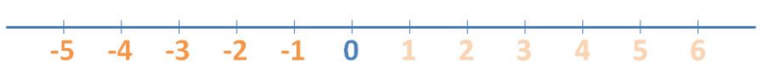
  <small>
Recta númerica
</small>

**Ley de los signos.**

  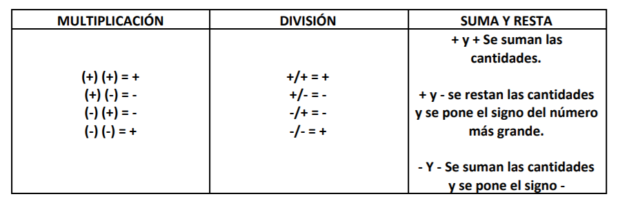
  <small>
Ley de los signos
</small>

### Razones

Una razón es una **comparación entre dos o más cantidades**. Puede expresarse mediante una **fracción**. Si las cantidades a comparar son a y b, la razón entre ellas se escribe como:

  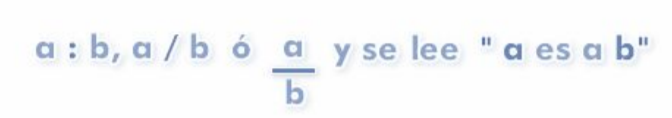
  <small>
Razon
</small>

Las razones se pueden amplificar y/o simplificar, y se mantiene la razón.

  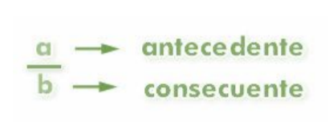
  <small>
Razon
</small>

**Ejemplo:**

Si hay 33 vehículos entre automóviles y camionetas y la razón entre ellos es 4:7 ¿cuántos
automóviles hay? En este caso se está comparando la cantidad de automóviles con el de camionetas. Para conocer la cantidad de automóviles que hay podemos seguir los siguientes pasos:
* 1 se considera el total de vehículos: 33
* 2 Se divide 33 por la suma entre el numerador y el denominador de nuestra razón (4+7= 11. Con esto se obtienen 11 partes con 3 unidades cada una (ya que 33:11 = 3). 
* 3 Se consideran 4 partes para los automóviles y 7 para las camionetas.

  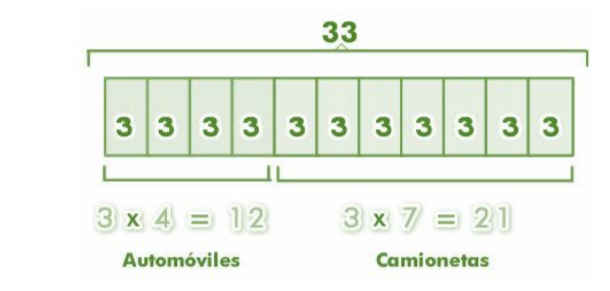
  <small>
Ejemplo
</small>

### Proporciones

Una proporción **es la igualdad de dos razones**.

  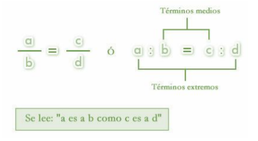
  <small>
Igualdad entre razones
</small>

En toda proporción, el producto de los términos medios es igual al producto de los términos
extremos (Teorema fundamental de las proporciones). Es decir:

  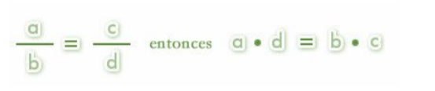
  <small>
Teorema fundamental de las proporciones
</small>

  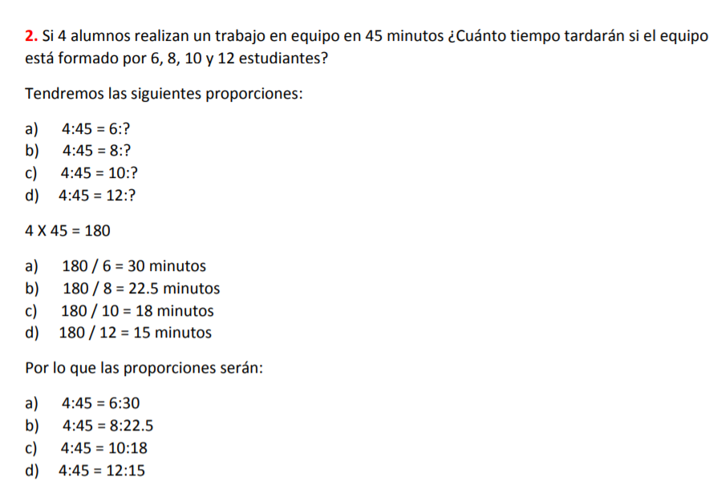
  <small>
Ejercicio
</small>

### Teorema de Thales 

**Semejanza de triángulos.** Esencialmente, **dos triángulos son semejantes si sus ángulos son congruentes (tienen la misma medida).** Esto da lugar al hecho de que, si dos triángulos son semejantes, sus lados correspondientes (u homólogos) son proporcionales

> El **primer teorema de Tales** enuncia que si en un triángulo dado se traza una recta paralela a cualquiera de sus lados, el nuevo triángulo que se obtiene será semejante al triángulo inicial.

  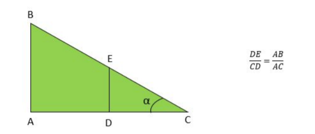
  <small>
Triangulos semejantes
</small>

Ejemplos

  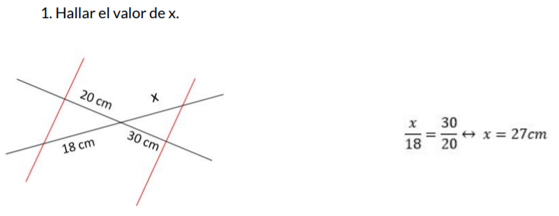
  <small>
Triangulos semejantes
</small>

2. Las maderas de las repisas de la figura son paralelas. Calcula las longitudes de las maderas representadas como x e y.

  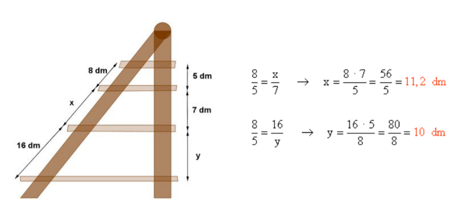
  <small>
Triangulos semejantes
</small>

## Series
### Series númericas

Son sucesiones ordenadas de números que guardan un vínculo entre sí

* Finitas
* Infinitas
* Ascendentes
* Descendentes

Ejemplos

a) 1, 3, 5, 7,... R. 9
b) 10, 11, 40, 12, 13, 50,... R. 14
c) 2000, 1000, 500, 250,... R. 125
d) 40, 5, 8, 20, 4,... R. 5
e) 76543, 2109, 876,... R. 54

### Series alfabéticas

Sucesiones ordenadas de letras que guardan un vínculo entre sí

* Ascendente
* Descendente

a) a, m, b, c, m, d, e, f, m, g, h, i, j,… m
b) a, z, b, b, y, c, c, c, x, d, d, d,… d
c) G - F - H - L - K - M - P - O - Q - ... U
d) A - Z - C - V - F - S - J -... Q

### Series de figuras

Sucesiones ordenadas de figuras que fuardan un vínculo entre sí

Poseen uno o más patrones para establecer la siguiente figura

  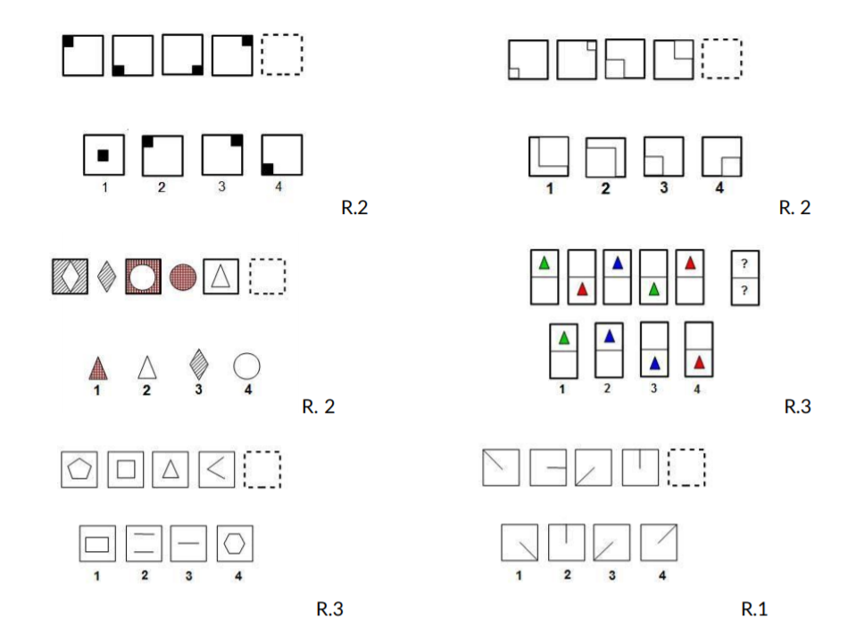
  <small>
Series de figuras
</small>

## Diagramas de flujo

Un diagrama de flujo es la **representación gráfica de la secuencia de rutinas** **simples¸ describe un proceso, sistema o algoritmo informático.**

### Toma de decisiones

El diagrama de flujo ofrece una **descripción visual de las actividades implicadas en un proceso.** Muestra la relación secuencial entre ellas, facilitando la rápida comprensión de cada actividad y su relación con las demás, el flujo de la información y los materiales, las ramas en el proceso, la existencia de bucles repetitivos, el número de pasos del proceso, facilita también la selección de la decisión.

### Simbología

  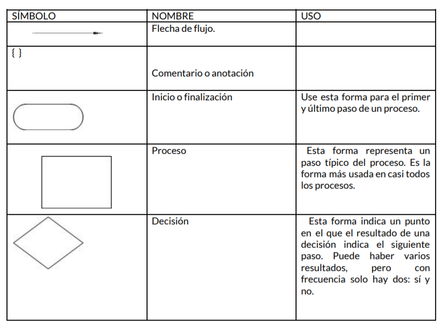
  <small>
Diagrama de flujo
</small>

  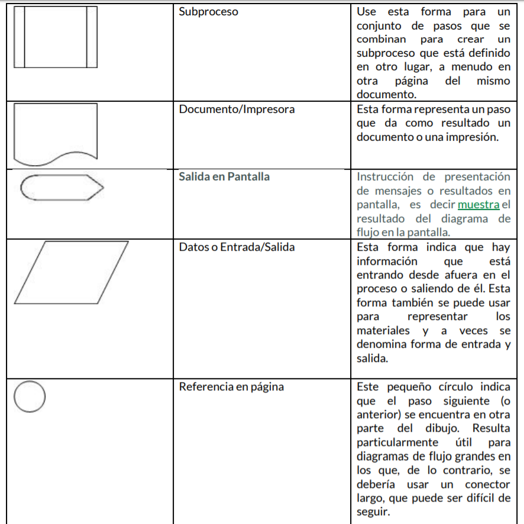
  <small>
Diagrama de flujo
</small>

  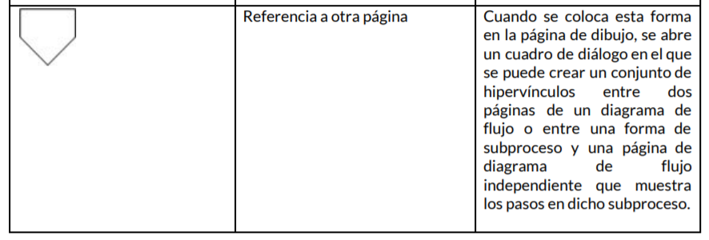
  <small>
Diagrama de flujo
</small>

### ¿Cómo hacer un diagrama de flujo?

1. **Define tu propósito y alcance**... ¿Qué deseas lograr? ¿Estás considerando las
cosas correctas con un punto inicial y final apropiado para alcanzar ese propósito? Realiza una investigación lo suficientemente detallada, pero lo suficientemente simple a la hora de crear tus diagramas para comunicarte con tu audiencia.
2. **Identifica las tareas en orden cronológico.** Esto puede involucrar las
conversaciones con los participantes, la observación de un proceso o la
revisión de cualquier documentación existente. Puedes escribir los pasos en
forma de notas o comenzar con un diagrama en versión borrador.
3. **Organízalos** por tipo y figura correspondiente, como procesos, decisiones,
datos, entradas o salidas.
4. **Crea tu diagrama**, ya sea dibujándolo a mano o usando un programa.
5. **Confirma tu diagrama de flujo**, verificando todos los pasos con las personas
que participan en el proceso. Observa el proceso para asegurarte de no dejar
de lado nada que sea importante para tu propósito.

### Algoritmos

Como una representación visual del flujo de datos, los diagramas de flujo son **útiles para escribir un programa o algoritmo** y explicárselo a otros o colaborar con otros en el mismo. Puedes usar un diagrama de flujo para explicar detalladamente la lógica detrás de un programa antes de empezar a codificar el proceso automatizado.

Puede ayudar a organizar una perspectiva general y ofrecer una guía cuando llega
el momento de codificar.

**Los diagramas de flujo pueden:**

* Explicar la lógica
* Organizar una perspectiva general antes de codificar
* Demostrar cómo el código está organizado.
* Visualizar la ejecución de un código dentro de un programa.
* Mostrar la estructura de un sitio web o aplicación.
* Comprender cómo los usuarios navegan por un sitio web o programa.

Los diagramas relacionados que se emplean en el software informático incluyen:
* **Lenguaje unificado de modelado (UML):** este es el lenguaje de propósito general usado en la ingeniería de software para el modelado.
* **Diagramas Nassi-Shneiderman (NSD):** usados para la programación informática estructurada. Llevan el nombre de sus creadores: Isaac Nassi y Ben Shneiderman, quienes los desarrollaron en 1972 en la Universidad Estatal de Nueva York en Stony Brook. También se denominan "estructogramas".
* **Diagramas DRAKON:** DRAKON es un lenguaje de programación visual de algoritmos empleado para crear diagramas de flujo.

### Estructuras de control : Palabras reservadas

#### Estructura de control secuencial

La estructura de control secuencial **representa la organización de sentencias o instrucciones consecutivas que se van ejecutando una después de la otra.** Este diagrama comienza con el punto de entrada y la línea de flujo ( −→ ) apunta al primer rectángulo de acción que indica la primera sentencia a ejecutar y continua con el flujo que apunta a otro rectángulo de acción y así podríamos seguir colocando n rectángulos de acción y termina con el punto de salida. **Todas las estructuras de control tienen la característica de tener un único punto de entrada y un único punto de salida.**

  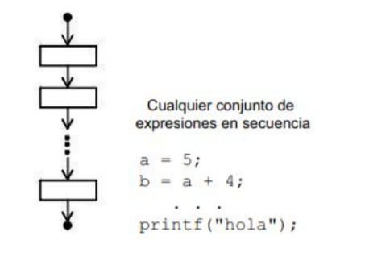
  <small>
estructuras de control
</small>

#### Estructura de control de selección simple

La estructura de control de selección simple representa una estructura que si se cumple alguna condición se realizan algunas acciones, mientras que si no se cumple, no se realizan dichas acciones.

Conocido como IF

  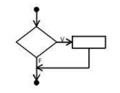
  <small>
estructuras de control
</small>

#### Estructura de control de selección doble

La estructura de control de selección doble es una estructura que introduce una condición, si es verdadera, realiza un bloque de acciones; y si es falsa, hace otro bloque de acciones.

Conocido como IF - Else

  
  <small>
estructuras de control
</small>

#### Estructura de control de selección multiple

La estructura de control de selección múltiple, es una estructura que evalúa una expresión que puede tomar varios y dependiendo del valor que tome realiza un conjunto de acciones.

Conocido como Switch

  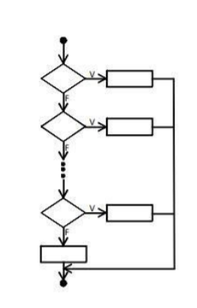
  <small>
estructuras de control
</small>

#### Repetición mientras

La estructura de control de repetición mientras es un ciclo que repite un bloque de
instrucciones mientras la condición es verdadera. La característica que la distingue de otros ciclos es que verifica la condición antes de ejecutar las acciones.

Conocido como While

  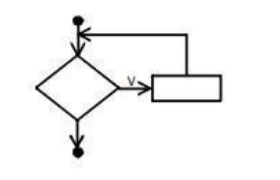
  <small>
estructuras de control
</small>

#### Repetición hacer mientras

La estructura de control de repetición hacer/mientras es otro de los ciclos que proporciona el lenguaje C. De manera semejante al ciclo anterior, esta estructura repite un bloque de instrucciones mientras una condición sea verdadera. La característica que distingue a este ciclo, es que primero realiza las acciones y después verifica la condición. Es decir, que en esta estructura las acciones se realizan al menos una vez.

Conocido como Do-While

  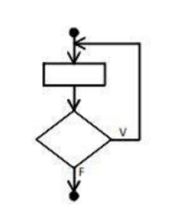
  <small>
estructuras de control
</small>

#### Repetición para hasta

Se utiliza para repetir un conjunto de acciones, hasta que se deje de cumplir una condición. La característica que distingue este ciclo es que está diseñado para repetir un bloque de instrucciones de un valor inicial hasta un valor final.

Conocido como For

  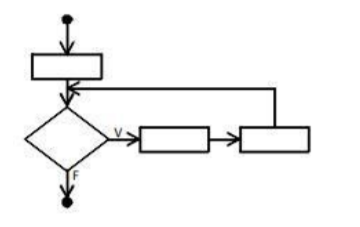
  <small>
estructuras de control
</small>

