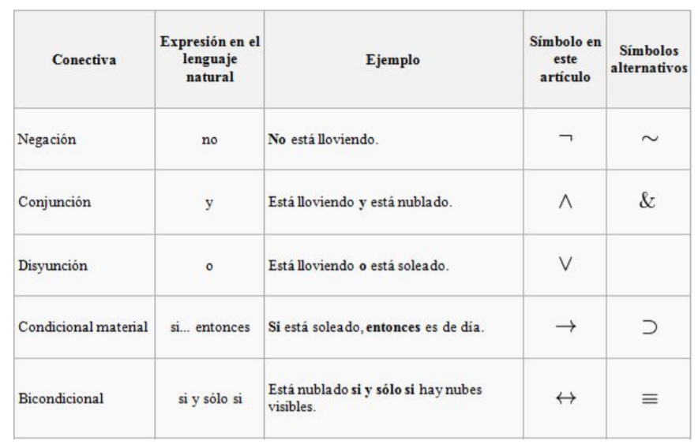

# Lógica <!-- omit in toc -->

> Mejora de habilidades para el pensamiento

## Tabla de Contenido<!-- omit in toc -->
- [Pensamiento lógico](#pensamiento-l%c3%b3gico)
  - [Habilidades básicas del pensamiento](#habilidades-b%c3%a1sicas-del-pensamiento)
  - [Lógica proposicional](#l%c3%b3gica-proposicional)
    - [Elementos](#elementos)
    - [Inferencia lógica](#inferencia-l%c3%b3gica)
    - [Tipos de inferencia](#tipos-de-inferencia)
      - [Según el número de premisas](#seg%c3%ban-el-n%c3%bamero-de-premisas)
      - [Según la forma de razonamiento.](#seg%c3%ban-la-forma-de-razonamiento)
      - [Proposiciones lógicas](#proposiciones-l%c3%b3gicas)
        - [DOBLE NEGACIÓN (DN)](#doble-negaci%c3%93n-dn)

# Pensamiento lógico
## Habilidades básicas del pensamiento
Proceso que permiten ***obtener información precisa y ordenada de las características de un objeto de observación y así poder tomar decisiones, hacer conclusiones o resolver problemas***
* **Observación.** La percepción se da a partir de nuestros 5 sentidos. **Puede ser concreta** (que se da en el instante ante una situación o hecho) y **la abstracta** que se da con experiencia previa
  * Percibimos por nuestros sentidos
  * Recopilamos la información
  * La registramos
  * Identificamos lo que está pasando
* **Descripción.** **Respondemos preguntas** sobre lo que ya percibimos. **Informa de manera** **clara** las características del objeto observado
  * ¿Qué es?
  * ¿Qué tiene?
  * ¿Cómo es?
  * ¿Qué función cumple?
  * ¿Qué pasó?
* **Comparación.** se da a partir de la observación. Cuándo logras establecer **diferencias y semejanzas**, llegas a **particularizar** o **generalizar** y como consecuencia comparar
* **Relación.** Observamos, comparamos y unimos con algún nexo >,<,=. ¿Qué puedes afirmar o negar del objeto?
  * Por ejemplo: Violeta tiene 18 años y Luvia 21. La **variable** es la edad. Violeta es menor que lluvia
* **Clasificación.** Es el proceso de **agrupar** objetos que cuentan con **semejanzas**. 
  * Zapatos rojos
  * Zapatos marrones
  * Zapatos altos
  * Zapatos con agujetas
  * Zapatos deportivos

## Lógica proposicional

Proceso que **analiza** las relaciones entre las **preposiciones**, asó como la **verdad o falsedad** de las mismas

* **Lógica** estudia los métodos y principios que se usan para distinguir el razonamiento correcto del incorrecto.
* **Enunciado**. Conjunto de palabras.
* **Proposición**. Enunciado que es verdadero o falso.
* **Argumento**. Proposiciones que conducen a una conclusión.
* **Premisa**. Proposición aseverada o supuesta que sirve de apoyo o razón para aceptar la conclusión de un argumento.
* **Conclusión**. Es la proposición aseverada con base en otras proposiciones (premisas) del argumento.

* **Inferencia** es el proceso de razonamiento, compuesto por proposiciones, por el cual se deriva o extrae una conclusión de una o varias premisas.
    > El término Inferencia es considerado como sinónimo de: “predicción”, “derivación” o “deducción”.

### Elementos

* **Variables.** Las variables proposicionales son los símbolos que sustituyen a las proposiciones. Se llaman de ese modo porque su significado cambia en las diferentes argumentaciones o expresiones donde se utilicen.
  * Las letras más comunes para asignar las variables son **p, q, r, s, t.**
* **Conectores**. Alteran, relacionan o conectan enunciados simples haciéndolos complejos. Los más frecuentes son la **negación (¬), la conjunción (^) la disyunción (v), el condicional (→) y el bicondicional (↔).**
* **Auxiliares**. Cuando son muchos los enunciados complejos en un solo reglón, se utilizan los símbolos auxiliares. No tienen ningún significado lógico, pero se usan con el objetivo de clarificar la comprensión de los enunciados. Los **símbolos auxiliares son los paréntesis (…) y los
corchetes […].**

### Inferencia lógica
Es un razonamiento, compuesto por proposiciones, por el cual se deriva o extrae una conclusión de una o varias premisas.
El término Inferencia es considerado como sinónimo de: **“predicción”, “derivación” o “deducción”.**

### Tipos de inferencia
#### Según el número de premisas
* **Inferencia inmediata.** Es una forma de razonamiento que presenta una sola
premisa, de la cual derivamos una conclusión.
> P: Si Lucía siempre es puntual
> C: entonces, es falso que llegue tarde.
* **Inferencia mediata**. Es una forma de razonamiento compuesto por dos o más
premisas de las cuales se deriva la conclusión.
> P1. Todos los cuerpos se atraen.
> P2. La Tierra y Venus son cuerpos.
> C. La Tierra y Venus se atraen 

#### Según la forma de razonamiento.
* **Inferencia deductiva**. Es una forma de razonamiento cuya conclusión se deriva del contenido directo de las premisas enunciadas, haciendo referencia expresa de los términos enunciados.
> P1. Ningún mamífero nace del huevo.
> P2. Toda ave nace del huevo.
> C. Ningún ave es mamífero.
* **Inferencia inductiva.** Es un razonamiento cuyas premisas representan casos particulares de las cuales se deriva una conclusión que resulta un principio general.
> P1. El tucán tiene pico.
> P2. La guacamaya tiene pico.
> P3. La codorniz tiene pico.
> C. Toda ave tiene pico.

#### Proposiciones lógicas
La lógica proposicional es la parte de la lógica que estudia la formación
de proposiciones complejas a partir de proposiciones simples.

  
  <small>
Proposiciones lógicas
</small>

Considérese el siguiente argumento:
> P1. Mañana es miércoles o mañana es jueves.
> P2. Mañana no es jueves.
> C. Por lo tanto, mañana es miércoles.

##### DOBLE NEGACIÓN (DN)
¬¬p ↔ p
El esquema representa, “p doblemente negada equivale a p”. Siguiendo el esquema de una inferencia por pasos, la representaríamos así:

¬¬p “No ocurre que Ana no es una estudiante”
_____________________________________________________
p “Ana es una estudiante”
La regla ‘doble negación’, simplemente.
