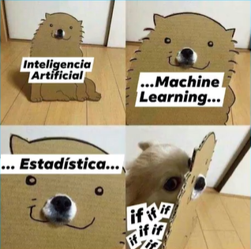
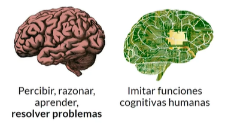
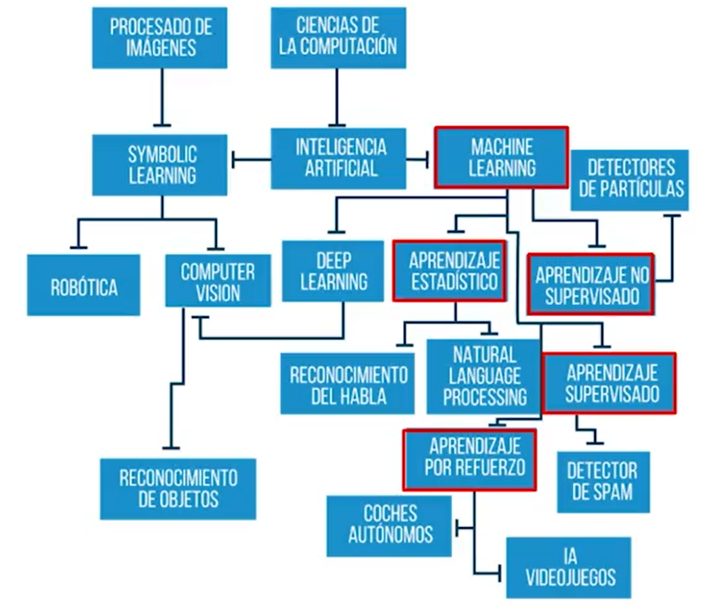
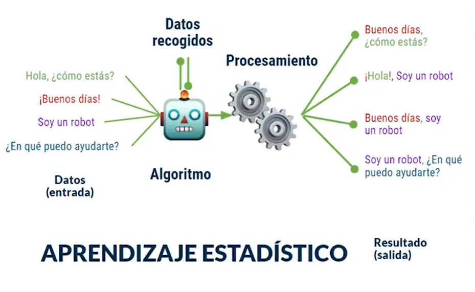
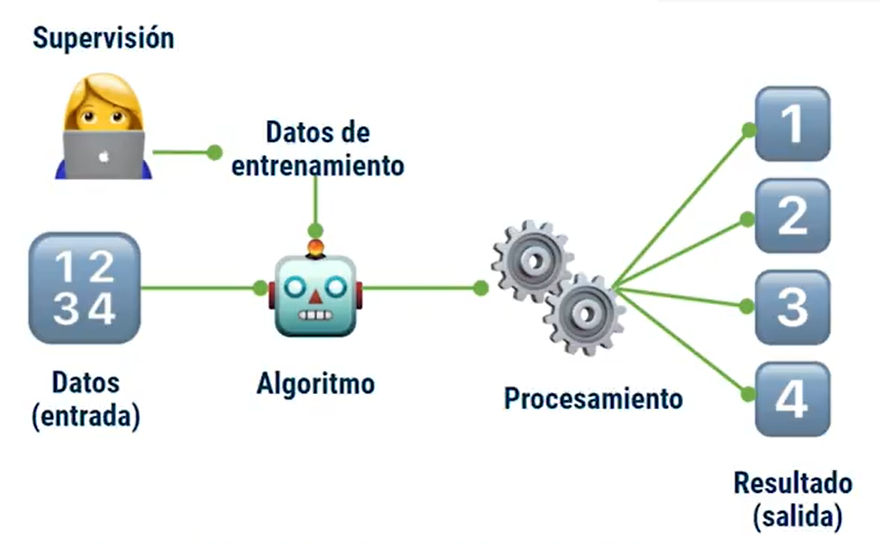
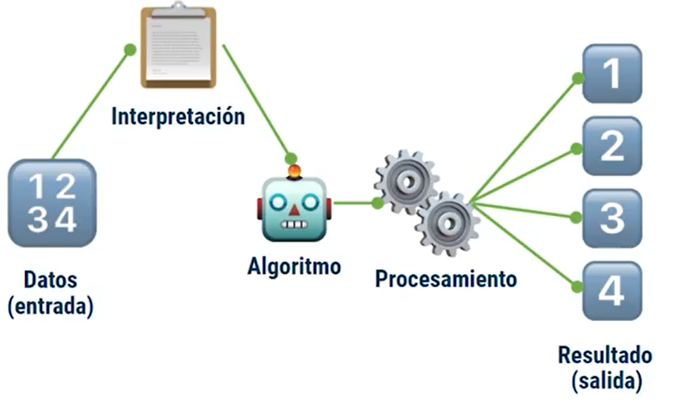
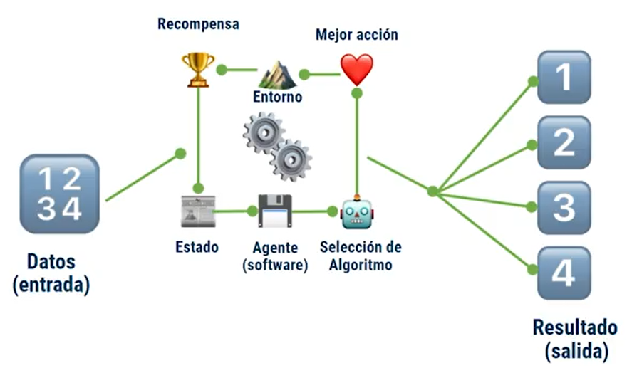
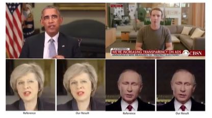
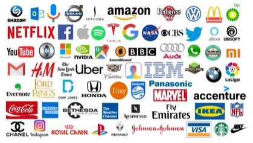
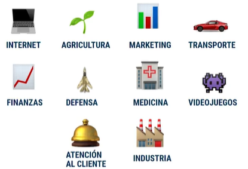

# Matemáticas para IA<!-- omit in toc -->

## Tabla de Contenido<!-- omit in toc -->
- [Introducción](#introducción)
  - [Ramas](#ramas)
  - [Aprendizaje estadístico](#aprendizaje-estadístico)
  - [Aprendizaje supervisado](#aprendizaje-supervisado)
  - [Aprendizaje no supervisado](#aprendizaje-no-supervisado)
  - [Aprendizaje por refuerzo](#aprendizaje-por-refuerzo)
  - [Implicaciones](#implicaciones)
  - [Panorama](#panorama)

# Introducción

* 250 a.C Ctesibio de Alejandria
  * Primera maquina autocontrolada (molino)
* 1843 Ada Lovelace
  * Primer algoritmo
* 1936 Alan Turing
  * Primera calculadora
* 1959 Marvin Minsky y J.Mc. Carthy
  * Fundan el laboratorio de inteligencia artificial en el MIT

> La ciencia e ingenio de crear maquinas inteligentes
> **John McCarthy 1956**

  

Actualmente queremos que una maquina pueda:

  

Que queremos:

* Aprender
* Adaptarse
* Tomar decisiones

Por medio de::

> Desarrollo de métodos y algoritmos que permitan comportarse a las computadoras de modo inteligente
> **Idea principal**

## Ramas

  

## Aprendizaje estadístico

  

## Aprendizaje supervisado

  

## Aprendizaje no supervisado

  

## Aprendizaje por refuerzo

  

## Implicaciones

DeepFakes

  

## Panorama

Marcas que implementan IA y muchas más

  

  

