# Probabilidad y estadística <!-- omit in toc -->

> Mejora de habilidades para el pensamiento

## Tabla de Contenido<!-- omit in toc -->
- [Libros digitales](#libros-digitales)
- [Introducción](#introducción)
  - [Investigación](#investigación)
    - [Propositos](#propositos)
    - [Proceso](#proceso)
    - [Pasos en el proceso de investigación](#pasos-en-el-proceso-de-investigación)
- [Muestra](#muestra)
- [Estadística descriptiva univariada](#estadística-descriptiva-univariada)
  - [Los tres análisis descriptivos fundamentales](#los-tres-análisis-descriptivos-fundamentales)
    - [Tablas de frecuencias](#tablas-de-frecuencias)
    - [Gráficos](#gráficos)
      - [Pastel](#pastel)
      - [Histograma](#histograma)
      - [Resúmenes numéricos](#resúmenes-numéricos)
        - [Medidas de tendencia central (centralización)](#medidas-de-tendencia-central-centralización)
        - [Medidas de dispersión](#medidas-de-dispersión)
      - [Resumiendo](#resumiendo)
  - [Datos agrupados con frecuencias](#datos-agrupados-con-frecuencias)
    - [Datos agrupados y no agrupados (agregaciones)](#datos-agrupados-y-no-agrupados-agregaciones)
  - [Medidas de posición](#medidas-de-posición)
    - [Los cuartiles (Q)](#los-cuartiles-q)
  - [Los deciles](#los-deciles)
  - [Los percentiles (Pp)](#los-percentiles-pp)
  - [Diagrama de bigotes](#diagrama-de-bigotes)
  - [Asimetría](#asimetría)
    - [Coeficiente de Karl Pearson**](#coeficiente-de-karl-pearson)
    - [Medida de Yule Bowley o medida cuaartílica](#medida-de-yule-bowley-o-medida-cuaartílica)
    - [Medida de fisher](#medida-de-fisher)
  - [Ejercicios](#ejercicios)
- [Estadística bidimensional o bivariada](#estadística-bidimensional-o-bivariada)
  - [Dos variables aleatorias](#dos-variables-aleatorias)
  - [Tabla de doble entrada o tabla de contingencia](#tabla-de-doble-entrada-o-tabla-de-contingencia)
  - [Relación entre dos variables](#relación-entre-dos-variables)
    - [Distribuciones bidimensionales](#distribuciones-bidimensionales)
    - [Regresión líneal](#regresión-líneal)
    - [Medidas de relación entre dos variables](#medidas-de-relación-entre-dos-variables)
  - [Covarianza](#covarianza)
  - [Correlación](#correlación)
    - [Correlación directa o positiva](#correlación-directa-o-positiva)
    - [Correlación inversa o negativa](#correlación-inversa-o-negativa)
    - [Correlación nula](#correlación-nula)
    - [Coeficiente de correlación lineal de pearson](#coeficiente-de-correlación-lineal-de-pearson)
  - [Regresión líneal simple](#regresión-líneal-simple)
    - [Coeficiente de determinación](#coeficiente-de-determinación)
  - [Ejercicios y explicaciones](#ejercicios-y-explicaciones)

# Libros digitales

https://joanby.github.io/bookdown-probabilidad/

https://joanby.github.io/bookdown-estadistica-inferencial/

https://www.odiolaestadistica.com/estadistica-python/

# Introducción

> La estadística está muy **involucrada en la toma de decisiones**

* Pensamiento inteligente
* Aprendizaje práctico
* Observaciones con sentido

> Es un conjunto de procedimientos para **reunir, medir, codificar, computar, analizar y resumir información númerica adquirida sistemáticamente.**

Su fuente principal son los **datos**, siguiendo los procedimientos científicos. Recolectar datos tiene diferentes propositos:

* **Estadística descriptiva** - Datos sobre categorías, personas u objetos y resumir la información en pocas cifras, matemáticas exactas, tablas y gráficas. 
* **Estadística inferencial** - Observaciones registradas y que tan frecuente ocurrieron en los datos de cada observación. Extraer conclusiones sobre las relaciones matemáticas, relaciones causa-efecto, prueba de hipótesis y teorias, entre las características de un grupo de personas u objetos.

## Investigación
Proceso que sigue una serie de pasos utilizando herramientas en situaciones de nuestra vida cotidiana.

* Rigurosa
* Organizada
* Sistemática
* Empírica
* Crítica

### Propositos
* Producir conocimientos
* Resolver problemas prácticos

### Proceso
* Organizar ideas
* Hacer predicciones
* Reunir datos

### Pasos en el proceso de investigación
* Específicar la(s) pregunta(s)
  * ¿Cuáles son las variables? (dependiente e independientes)
  * ¿Cuáles son las causas y los efectos?
  * ¿Qué se quiere resolver?
  * ¿Por qué sucede algo?
  * ¿Cuál es la influencia?
* Revisar la literatura
* Proponer una teoría y formular una hipótesis
  * Indicadores, métricas y parámetros
* Seleccionar un diseño de investigación
  * Tipo, nivel y diseño
* Recolectar los datos
  * Ir a los hechos
  * Aplicar métodos de extracción
  * Utilizar herramientas
* Análizar los datos y sacar herramientas
* Difundir los resultados
  * Defender tu investigación
  * Aprobar o rechazar hipotesis

# Muestra

Todo subconjunto de la población es una muestra, está tiene qu ser

* **Aleatoria** - Todos los elementos deben tener la misma probabilidad de ser elegidos
* **Representativa**

  

**Variable aleatoria**

* Es una característica de la población
* Sigue un determinado comportamiento **"Distribución"**
  * **Discreta** - valores enteros, contables, númerables, opciones finitas (Ciudades)
  * **Continua** - númericos Valores reales (peso), altura

Ejemplo

  

* Nos interesa una característica, que va a ser la **variable aleatoria**
  * Puede ser discreta o continua
* Se mide la característica en una población, pero es demasiado grande, se toma una muestra representativa de esa característica en la pobleción
* Obtenemos información de esa población

# Estadística descriptiva univariada

## Los tres análisis descriptivos fundamentales

Tiene como característica resumir, analizar y sacar conclusiones de un conjunto de datos
* Tabla de frecuencias
* Gráficas
* Resumenes númericos

### Tablas de frecuencias

  

  

### Gráficos

#### Pastel

  

#### Histograma

  

  

#### Resúmenes numéricos

##### Medidas de tendencia central (centralización)

Media o promedio

  

  

  

Ejercicios

Calcular la media y la mediana

  

Para la mediana, ordenar los datos de menor a mayor y escoger el del medio

  

##### Medidas de dispersión

Varianza y desviación típica: Cuán alejados están los datos de la media

La varianza es el promedio de las distancias hacia la media

  

La desviación típica es la raíz de la varianza

  

#### Resumiendo

* Las tablas de frecuencias: informaición numérica sobre los datos
* Los gráficos son información visual
* Los resúmenes numéricos: media, mediana, varianza, desviación típica, etc.

[Formulas](../pye/Formulas1.pdf)

## Datos agrupados con frecuencias

Se ha solicitado a un grupo de 50 individuos información sobre el número de horas que dedican diariamente a dormir. La clasificación de las respuestas ha permitido elaborar la siguiente tabla

  

### Datos agrupados y no agrupados (agregaciones)

Es una forma distinta de representar y analizar la información que se ha reunido.

* Los **datos no agrupados** es el conjunto de observaciones que se presentan en su forma original tal y como fueron recolectados, para obtener información directamente de ellos
* Los **datos agrupados** es cuando tenemos los valores o **intervalos de valores** (buckets) que toma la variable y la **frecuencia de ocurrencia**. Es una forma más compacta de ver los datos

Para calcular la media o promedio

  

Para calcular la mediana

La media es el valor central de los datos ordenados. Al ser un valor par 50, la mitad es 25, hay dos valores centrales. Posición 25 y 26 y hay que obtener la media de ellos. Para ello podemos usar la frecuencia absoluta acumulada

  

Para la moda

Con la frecuencia absoluta tenemos el valor que más se repite:

  

En el caso de que las clases estén representadas con intervalos, hablaremos de 

Desviación típica y la varianza

  

  

Ejemplo

Se tienen los siguientes datos de peso en kg de 100 individuos

  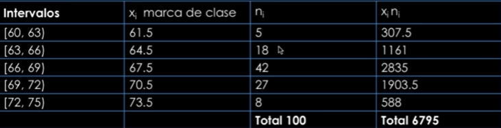

Para calcular la media

  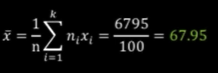

Para la mediana se encuentra en n/2

  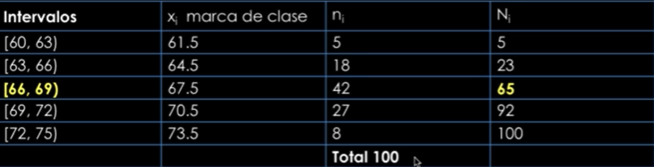

n/2=100/2=50, en este caso el intervalo de la mediana es (66,69)

  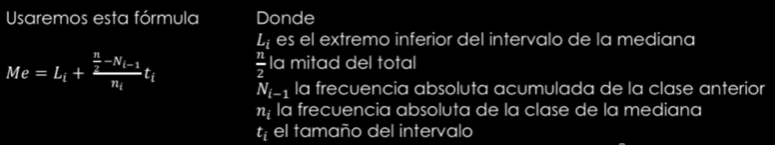

Para la moda

  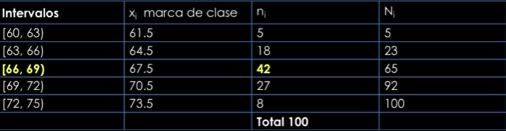

  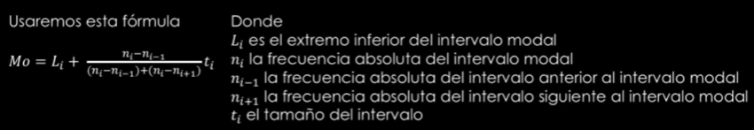

  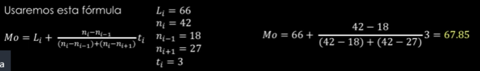

[Ejercicio](../pye/Ejercicio1.pdf)

## Medidas de posición

Se llaman en general **cuantiles** y se pueden clasificar en tres grandes grupos

* **Cuartiles** (25%, 50%, 75%)
* **Quintiles** (20%, 40%, 60%, 80%)
* **Deciles** (10%, 20%, 30% ... 90%)

Dividen a una distribución ordenada en partes iguales

Para calcular las medidas de posición es necesario que los datos estén ordenados de menor a mayor

### Los cuartiles (Q)
Son los tres valores de la variable de una distribución que la dividen en cuatro partes iguales

  

Para calcularlos se debe seguir lo siguiente:

1. Se ordenan los datos, entonces el primer valor será el mínimo y el último el máximo
2. Se determina la posición que ocupa cada cuartil, se puede usar la fórmula:
   * Q1 es el que deja por debajo un 25%
   * Q2 es el que deja por debajo un 50%, **coincide con la mediana**
   * Q3 es el que deja por debajo un 75%

  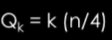

Ejemplo

  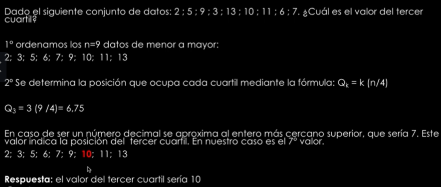

## Los deciles

Corresponden a los 9 valores que dividen a los datos en 10 partes iguales, es decir, 10%, 20% .... 90%

  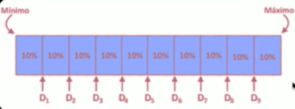

## Los percentiles (Pp)

Son los noventa y nueve valores de la variable que la dividen en cien partes, se designan por P1, P2 ... P99

> P50 coincide con la mediana

El percentil p(pp) es un valor de la variable tal que el p% de la muestra está por debajo

Se calcula de la siguiente manera

  

* Sí es decimal **se aproxima al entero más cercano superior**
* Buscamos este valor en la columna de la frecuencia acumulada
* El primer valor de x cuya frecuencia acumulada sobrepasa el resultado de este cálculo es el percentil buscado
* También se puede hacer con frecuencias relativas acumuladas

Ejemplo

  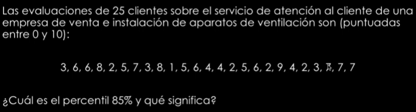

  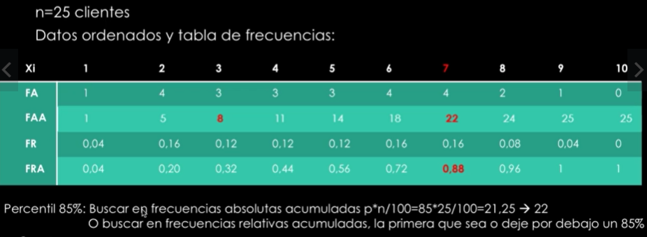

  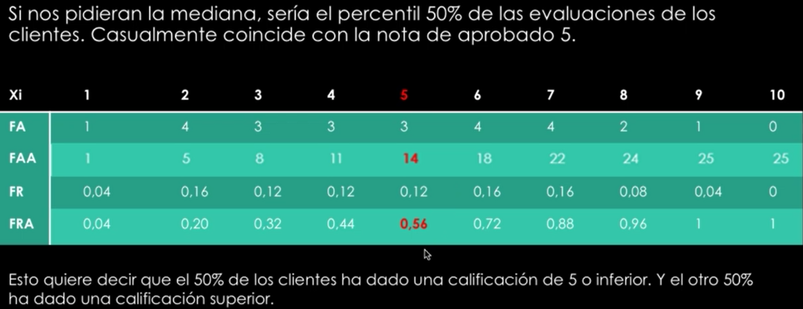

  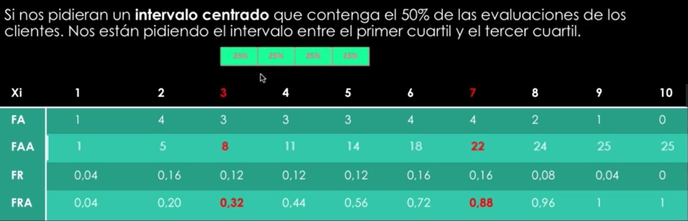

Para este caaso entre las notas 3 y 7 hay un 50%. El intervalo estaría centrado en la evaluación 5 que es la mediana

## Diagrama de bigotes

Son una representación visual que describe varias características importantes, al mismo tiempo, tales como la dispersión y la simetría

* Se representan los 3 cuartiles, Q1, Q2 (mediana) y Q3

  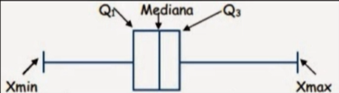

  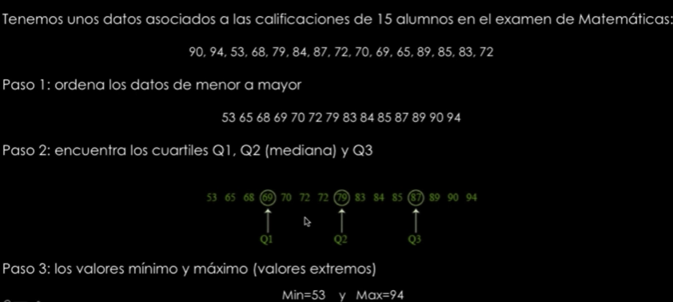

  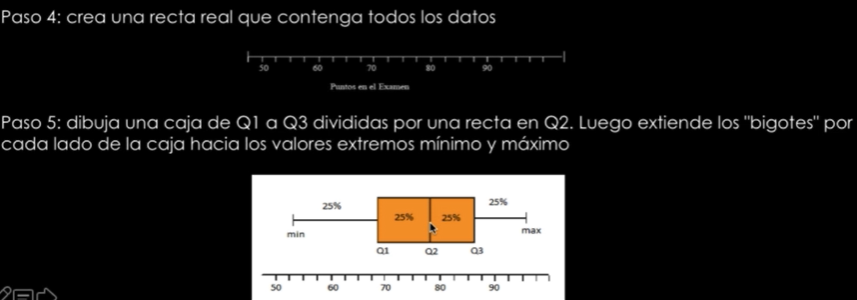

  

* Podemos encontrar datos mucho más grandes o mucho más pequeños que el resto de los datos. Esos valores son llamados atípicos o outliers
* Se representan con un punto y pueden estar en cualquiera de los dos extremos del diagrama

**Regla para encontrar valores atipicos:**

* Mayor que Q3 por al menos 1.5 veces el rango intercuartilico (RI)
* Menor que Q1 por al menos 1.5 veces el rango intercuartilico (RI)

A estos dos límites a partir de los cuales vamos a decir que un datos es atípico, les llamaremos barreras

  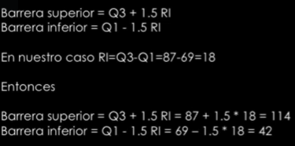

Viendo otro ejemplo:

  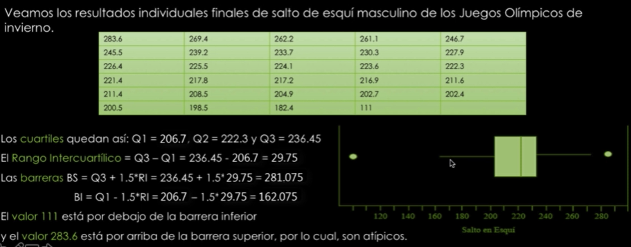

## Asimetría

Se dice así cuando la media, mediana y la moda no coinciden, por ende son asimetricas

  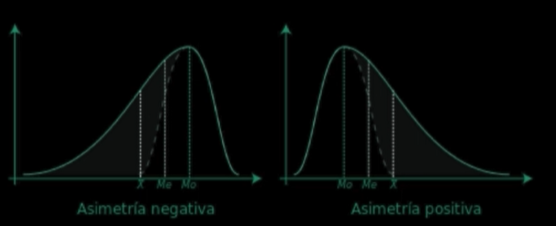

La **Simetría** se da cuando hay aproximadamente la misma cantidad de los datos a ambos lados de la media aritmética. La media aritmética, la mediana y la moda son iguales

  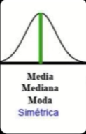

### Coeficiente de Karl Pearson**

  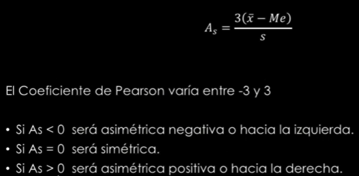

### Medida de Yule Bowley o medida cuaartílica

  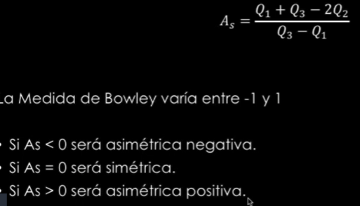

### Medida de fisher

  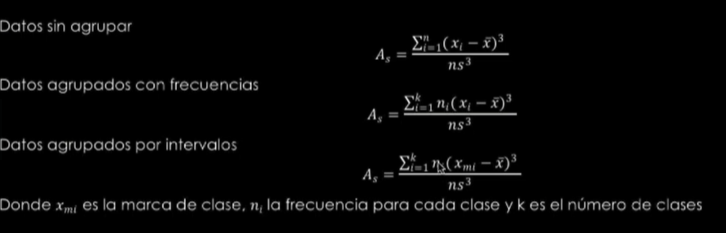

## Ejercicios

Ejercicio 1

  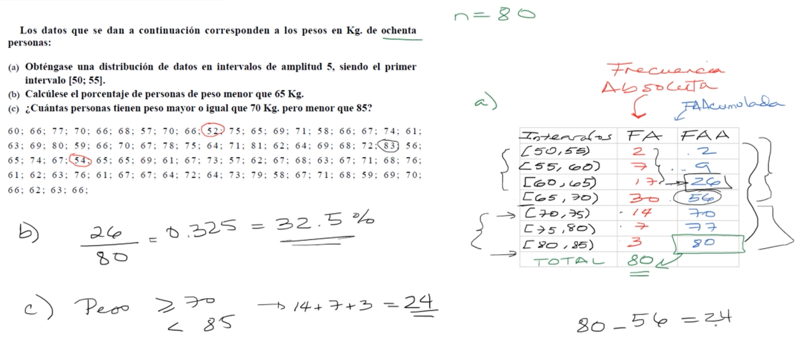

Ejercicio 2

  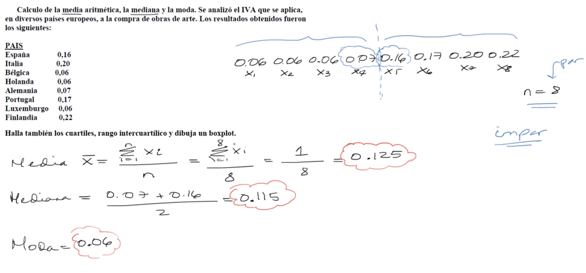

Identificando los cuartiles

  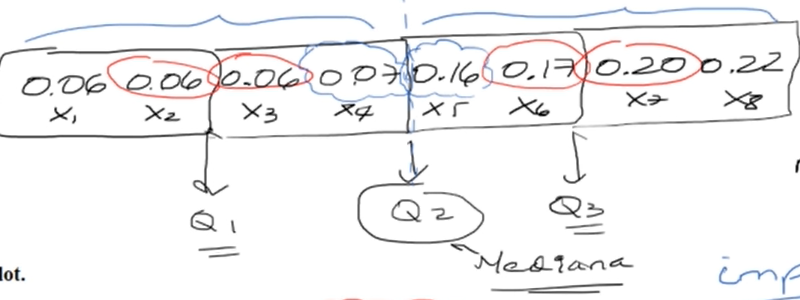

  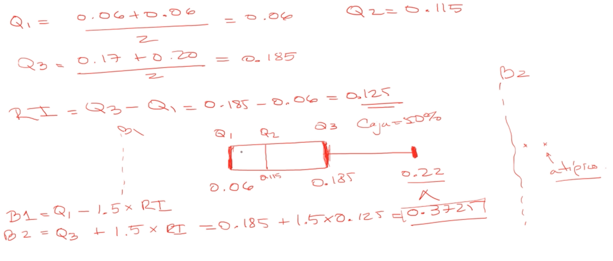

[Ejercicios de la unidad](../pye/Ejercicio2.pdf)

# Estadística bidimensional o bivariada

## Dos variables aleatorias

Es una variable en la que cada individuo está definida por un par de características (x,y)

Estás dos son a su vez variables aleatorias en las que existe relación entre ellas, **una de las dos es la variable independiente y la otra la variable dependiente**

  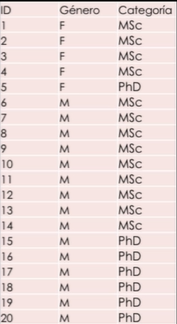

  

## Tabla de doble entrada o tabla de contingencia

Es una tabla de fecuencias conjuntas donde se ponen en las columnas los valores de una de las variables, y en las filas los valores de la otra variabl. Puede ser con frecuencias absolutas y también con frecuencias relativas

**Con frecuencias absolutas**

  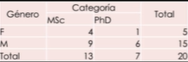

¿Cuál es el número de estudiantes mujeres del Dpto que están haciendo un doctorado PhD?

  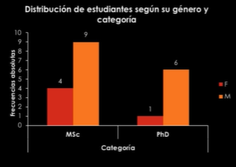

**Con frecuencias relativas (Porcentajes)**

  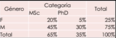

¿Cuál es el procentaje de estudiantes hombres que están haciendo un master?

  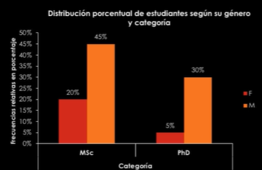

Dividiendo por el total de la fila

  

Del total de chicas ¿Cuántas de ellas están haciendo un master?
Del total de chicos ¿Cuántos están haciendo un master?

  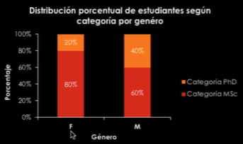

## Relación entre dos variables

x e y están relacionadas estadísticamente cuando conocida una de ellas se puede estimar aproximadamente el valor de la otra

* Ingresos y gastos de una familia
* Producción y ventas de una fábrica
* Gastos en publicidad y beneficios de una empresa
* Altura y peso
* Notas de un examen y nivel de estrés

### Distribuciones bidimensionales

Son aquellas en las que a cada individuo le corresponden los valores de dos variables, las representamos por el par (x,y)

Si representamos cada par de valores como las coordenadas de un punto, el  conjunto de todos los individuos representados de esta forma se llama **nube de puntos** y el gráfico se llama **diagrama de dispersión**

Si las variables tienen una tendencia lineal positiva (una crece cuando la otra decrece) o negativa una decrece cuando la otra crece, entonce sobre la nube de puntos puede trazarse una recta que se ajusta a ellos lo mejor posible, llamada **recta de regresión**

### Regresión líneal

Supongamos que las notas de 12 alumnos de una clase en Matemáticas y Física son las siguientes:

  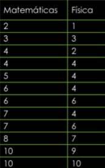

Se muestra una tendencia líneal positiva

  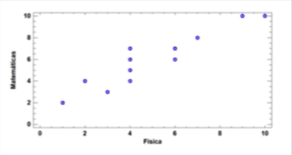

### Medidas de relación entre dos variables

La **covarianza** de una variable bidimensional (x,y) es la media aritmética de los productos de las desviaciones de cada una de las variables respecto a sus medias respectivas

Si hablamos de covarianza como parámetro **muestral** se denota como

  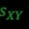

En cambio si es como parámetro poblacional se denota como

  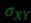

Infica el sentido de la relación

  

  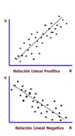

> Su valor depende de la escala elegida por los ejes

Para evitar los problemas de escala y unidades de medida de las dos variables en cuestión, se utilizo una medida llamada **correlación** que trata de establecer **la relación o dependencia que existe entre las dos variables que intervienen en una distribución bidimensional sin depender de su escala**

Si los cambios en una de las variables influyen en los cambios de la otra, diremos que las variables están correlacionadas o que hay correlación entre ellas

  

## Covarianza

**Para datos no agrupados**

Es la media aritméticad de los productos de las desviaciones de cada una de las variables respecto a sus medias respectivas

  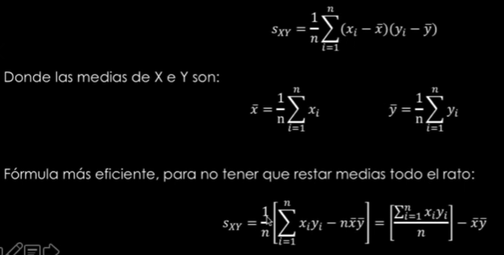

Ejemplo: las notas de 12 alumnos de la clase de Matemáticas y Física son las siguientes:

  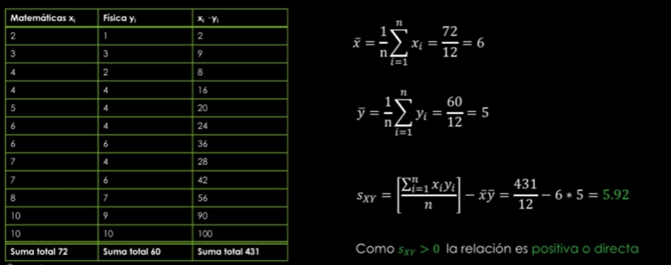

**Para datos agrupados**

  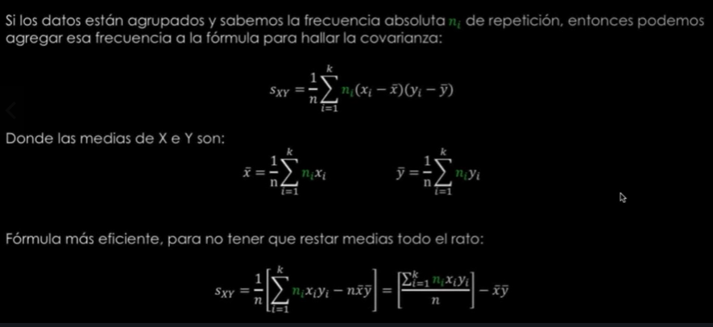

  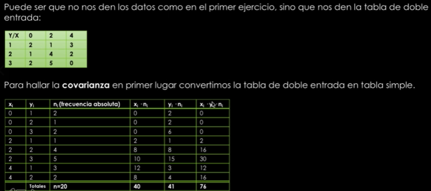

  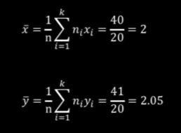

  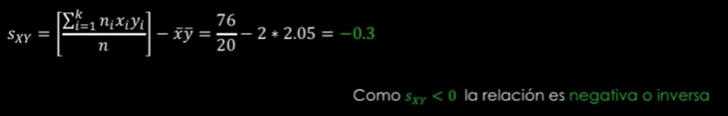

## Correlación

Trata de establecer la relación o dependencia lineal que existe entre las dos variables que intervienen: x e y

### Correlación directa o positiva

  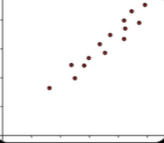

### Correlación inversa o negativa

  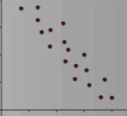

### Correlación nula

Sucede cuándo no hay dependencia entre las variables. La nube de puntos tiene una forma redondeada

Puede que no haya una dependencia lineal entre las variables pero si exista otro tipo de dependencia, como cuadrática exponencial, etc. Es decir, que la correlación sea nula no necesaria mente implica independencia entre las dos variables

  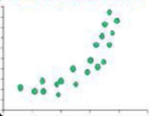

En caso de que haya correlación líneal. El **grado de correlación** indica la proximidad que hay entre los puntos y lo que seria la recta de regresión que representa la tendencia

  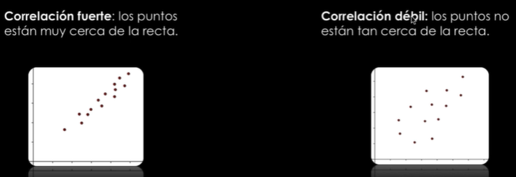

### Coeficiente de correlación lineal de pearson

  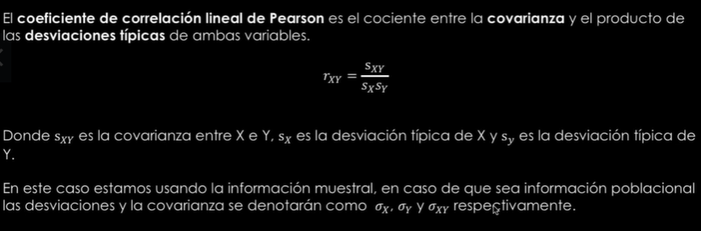

  

  

Para datos no agrupados

  

Para datos agrupados

  

  

## Regresión líneal simple

La recta de regresión es la que mejor se ajusta a la nube de puntos

  

Para el ejemplo de los alumnos de matemáticas

  

  

  

### Coeficiente de determinación

Una medida de cuán bueno es el modelo de regresión es el siguiente:

  

## Ejercicios y explicaciones

[Ejercicios de la unidad](../pye/Ejercicio3.pdf)

[Explicación coeficiente de variación](../pye/coeficienteVariacion.pdf)

[Formulas de regresión](../pye/Formulas2.pdf)