# Probabilidad y estadística <!-- omit in toc -->

> Mejora de habilidades para el pensamiento

## Tabla de Contenido<!-- omit in toc -->
- [Introducción](#introducción)
  - [Investigación](#investigación)
    - [Propositos](#propositos)
    - [Proceso](#proceso)
    - [Pasos en el proceso de investigación](#pasos-en-el-proceso-de-investigación)
- [Muestra](#muestra)
- [Estadística descriptiva univariada](#estadística-descriptiva-univariada)
  - [Los tres análisis descriptivos fundamentales](#los-tres-análisis-descriptivos-fundamentales)
    - [Tablas de frecuencias](#tablas-de-frecuencias)
    - [Gráficos](#gráficos)
      - [Pastel](#pastel)
      - [Histograma](#histograma)
      - [Resúmenes numéricos](#resúmenes-numéricos)
        - [Medidas de tendencia central (centralización)](#medidas-de-tendencia-central-centralización)
        - [Medidas de dispersión](#medidas-de-dispersión)
      - [Resumiendo](#resumiendo)
  - [Datos agrupados con frecuencias](#datos-agrupados-con-frecuencias)
    - [Datos agrupados y no agrupados (agregaciones)](#datos-agrupados-y-no-agrupados-agregaciones)

# Introducción

> La estadística está muy **involucrada en la toma de decisiones**

* Pensamiento inteligente
* Aprendizaje práctico
* Observaciones con sentido

> Es un conjunto de procedimientos para **reunir, medir, codificar, computar, analizar y resumir información númerica adquirida sistemáticamente.**

Su fuente principal son los **datos**, siguiendo los procedimientos científicos. Recolectar datos tiene diferentes propositos:

* **Estadística descriptiva** - Datos sobre categorías, personas u objetos y resumir la información en pocas cifras, matemáticas exactas, tablas y gráficas. 
* **Estadística inferencial** - Observaciones registradas y que tan frecuente ocurrieron en los datos de cada observación. Extraer conclusiones sobre las relaciones matemáticas, relaciones causa-efecto, prueba de hipótesis y teorias, entre las características de un grupo de personas u objetos.

## Investigación
Proceso que sigue una serie de pasos utilizando herramientas en situaciones de nuestra vida cotidiana.

* Rigurosa
* Organizada
* Sistemática
* Empírica
* Crítica

### Propositos
* Producir conocimientos
* Resolver problemas prácticos

### Proceso
* Organizar ideas
* Hacer predicciones
* Reunir datos

### Pasos en el proceso de investigación
* Específicar la(s) pregunta(s)
  * ¿Cuáles son las variables? (dependiente e independientes)
  * ¿Cuáles son las causas y los efectos?
  * ¿Qué se quiere resolver?
  * ¿Por qué sucede algo?
  * ¿Cuál es la influencia?
* Revisar la literatura
* Proponer una teoría y formular una hipótesis
  * Indicadores, métricas y parámetros
* Seleccionar un diseño de investigación
  * Tipo, nivel y diseño
* Recolectar los datos
  * Ir a los hechos
  * Aplicar métodos de extracción
  * Utilizar herramientas
* Análizar los datos y sacar herramientas
* Difundir los resultados
  * Defender tu investigación
  * Aprobar o rechazar hipotesis

# Muestra

Todo subconjunto de la población es una muestra, está tiene qu ser

* **Aleatoria** - Todos los elementos deben tener la misma probabilidad de ser elegidos
* **Representativa**

  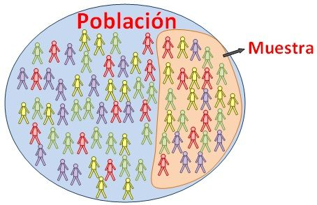

**Variable aleatoria**

* Es una característica de la población
* Sigue un determinado comportamiento **"Distribución"**
  * **Discreta** - valores enteros, contables, númerables, opciones finitas (Ciudades)
  * **Continua** - númericos Valores reales (peso), altura

Ejemplo

  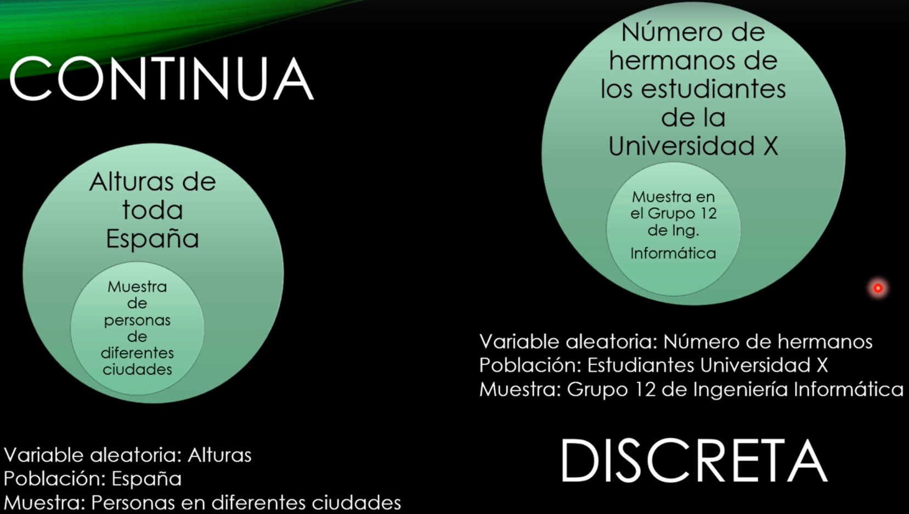

* Nos interesa una característica, que va a ser la **variable aleatoria**
  * Puede ser discreta o continua
* Se mide la característica en una población, pero es demasiado grande, se toma una muestra representativa de esa característica en la pobleción
* Obtenemos información de esa población

# Estadística descriptiva univariada

## Los tres análisis descriptivos fundamentales

Tiene como característica resumir, analizar y sacar conclusiones de un conjunto de datos
* Tabla de frecuencias
* Gráficas
* Resumenes númericos

### Tablas de frecuencias

  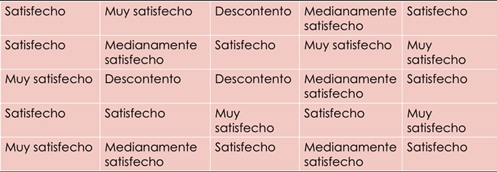

  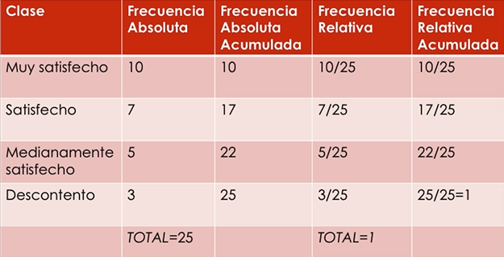

### Gráficos

#### Pastel

  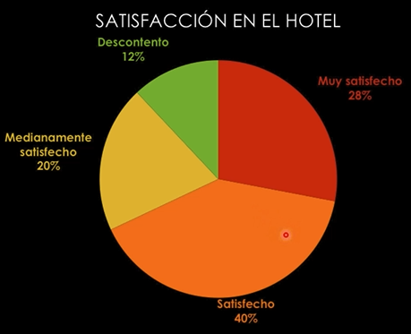

#### Histograma

  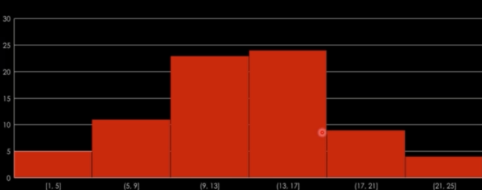

  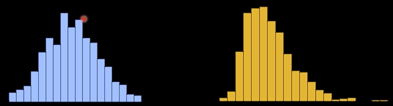

#### Resúmenes numéricos

##### Medidas de tendencia central (centralización)

Media o promedio

  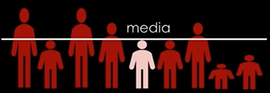

  

  

Ejercicios

Calcular la media y la mediana

  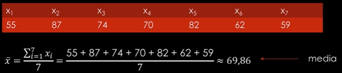

Para la mediana, ordenar los datos de menor a mayor y escoger el del medio

  

##### Medidas de dispersión

Varianza y desviación típica: Cuán alejados están los datos de la media

La varianza es el promedio de las distancias hacia la media

  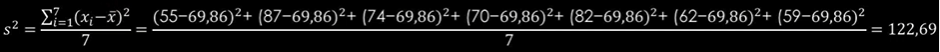

La desviación típica es la raíz de la varianza

  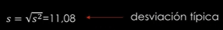

#### Resumiendo

* Las tablas de frecuencias: informaición numérica sobre los datos
* Los gráficos son información visual
* Los resúmenes numéricos: media, mediana, varianza, desviación típica, etc.

[Formulas](../pye/Formulas1.pdf)

## Datos agrupados con frecuencias

Se ha solicitado a un grupo de 50 individuos información sobre el número de horas que dedican diariamente a dormir. La clasificación de las respuestas ha permitido elaborar la siguiente tabla

  

### Datos agrupados y no agrupados (agregaciones)

Es una forma distinta de representar y analizar la información que se ha reunido.

* Los **datos no agrupados** es el conjunto de observaciones que se presentan en su forma original tal y como fueron recolectados, para obtener información directamente de ellos
* Los **datos agrupados** es cuando tenemos los valores o **intervalos de valores** (buckets) que toma la variable y la **frecuencia de ocurrencia**. Es una forma más compacta de ver los datos

Para calcular la media o promedio

  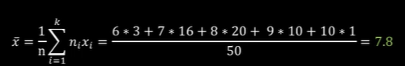

Para calcular la mediana

La media es el valor central de los datos ordenados. Al ser un valor par 50, la mitad es 25, hay dos valores centrales. Posición 25 y 26 y hay que obtener la media de ellos. Para ello podemos usar la frecuencia absoluta acumulada

  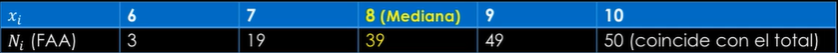

Para la moda

Con la frecuencia absoluta tenemos el valor que más se repite:

  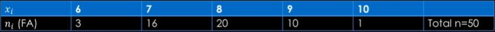

En el caso de que las clases estén representadas con intervalos, hablaremos de 

Desviación típica y la varianza

  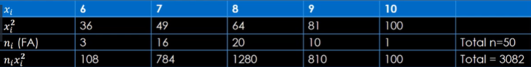

  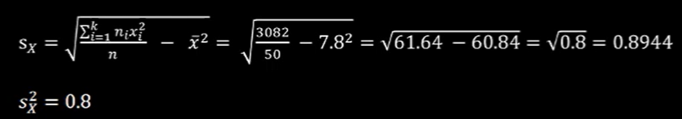

