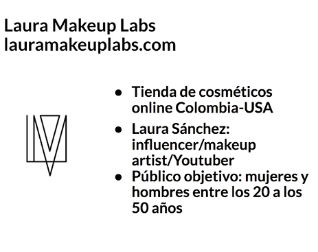
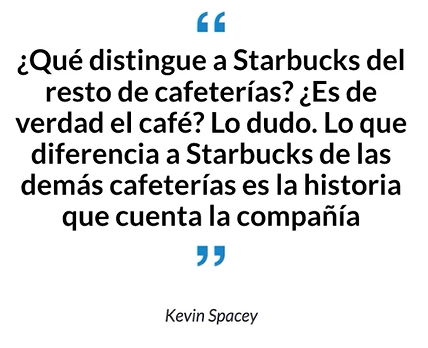
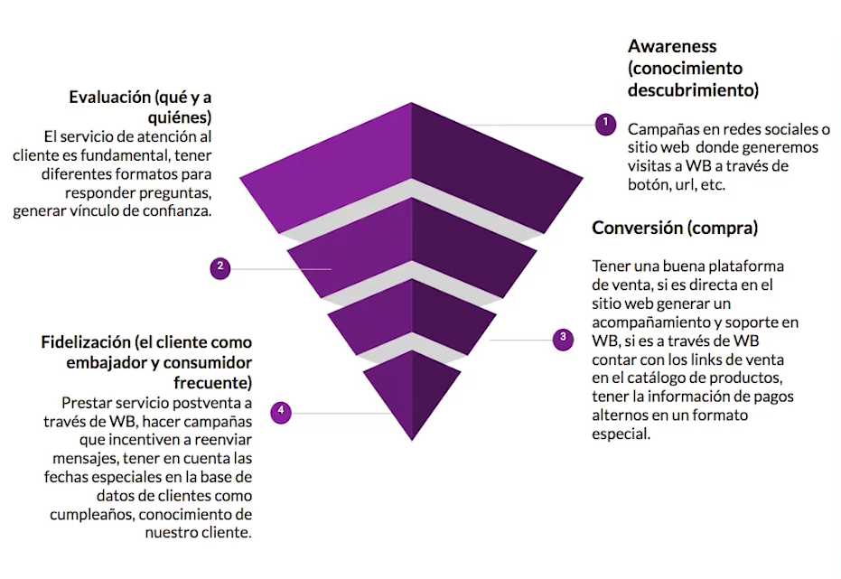

# WhatsApp Business<!-- omit in toc -->

## Tabla de Contenido<!-- omit in toc -->
- [Introducción](#introducción)
  - [¿Por qué WhatsApp es una herramienta fundamental dentro de una estrategia de marketing?](#por-qué-whatsapp-es-una-herramienta-fundamental-dentro-de-una-estrategia-de-marketing)
  - [Caso de estudio](#caso-de-estudio)
    - [objetivo](#objetivo)
    - [Herramientas](#herramientas)
- [Configuración](#configuración)
  - [¿Qué es WhatsApp Business y cuál es la diferencia con WhatsApp Messenger?](#qué-es-whatsapp-business-y-cuál-es-la-diferencia-con-whatsapp-messenger)
  - [Perfil de empresa](#perfil-de-empresa)
  - [Herramientas de mensajeria](#herramientas-de-mensajeria)
  - [Aspectos básicos de una campaña de marketing digital](#aspectos-básicos-de-una-campaña-de-marketing-digital)
  - [Tacticas para estrategía de marketing](#tacticas-para-estrategía-de-marketing)
    - [Base de datos](#base-de-datos)
    - [Manejo de datos personales](#manejo-de-datos-personales)
- [Marketing y negocios](#marketing-y-negocios)
  - [Marketing de Contenidos: ideas sobre manejo de comunicación a tráves de la plataforma](#marketing-de-contenidos-ideas-sobre-manejo-de-comunicación-a-tráves-de-la-plataforma)
  - [Personalización y atención al cliente: cómo conectarnos con la audiencia](#personalización-y-atención-al-cliente-cómo-conectarnos-con-la-audiencia)
  - [Aplicación de técnicas de WhatsApp Business a un funnel de conversión](#aplicación-de-técnicas-de-whatsapp-business-a-un-funnel-de-conversión)
  - [Conección con canales](#conección-con-canales)
- [WhatsApp Business API: la solución macro para grandes empresas](#whatsapp-business-api-la-solución-macro-para-grandes-empresas)

# Introducción

* Estrategias de venta
* Conocimientos en marketing digital

## ¿Por qué WhatsApp es una herramienta fundamental dentro de una estrategia de marketing?

* Transformación digital
* Conexión y relación con el cliente

Reporte de penetración de las herramientas

https://wearesocial.com/digital-2020

## Caso de estudio

  

### objetivo

Aumentar las ventas en un 10%  posicionando la marca para nuestro público actual y atrayendo publico de edades mayores durante el mes de mayo

### Herramientas

* Celular con whatsapp business
* Computadora para revisar materiales y sitios web
* Bitacora para desarrollar la campaña

# Configuración

## ¿Qué es WhatsApp Business y cuál es la diferencia con WhatsApp Messenger?

* Perfil de empresa
* Respuestas automatizadas
* Mensaje de bienvenida, ausencia y respuestas rápidas
* Estadística
* Tienda

## Perfil de empresa

* No puede ser el mismo número
* Se puede usar una línea de teléfono fijo
* Ten acceso a la línea para recibir el código de verificación
* Se puede compartir un enlace directo para redes sociales
* Creación de catálogo de productos

Acortar la URL

https://bitly.com/

## Herramientas de mensajeria

* Mensajes automáticos
  * Ausencia
  * Bienvenida
  * Respuestas rápidas
* Funciones masivas
  * Etiquetas
  * Grupos
  * Listas de difusión
* Otras funciones
  * Actualiación de estados
  * Estadísticas
  * Verificación de la cuenta

## Aspectos básicos de una campaña de marketing digital

* **Objetivo** Medible con KPIs cuantitativos y cualitativos
* **Estrategía** Conjunto de decisiones y acciones que vamos a tomar para cumplir esos objetivos
* **Tácticas** El método a través del cual vamos a desarrollar las estrategias

## Tacticas para estrategía de marketing

### Base de datos

* Nombre / Edad / Fecha de nacimiento
* Genero
* Ubicación
* E-mail
* Teléfono/Whatsapp
* Demografía

Usar etiquetas
Google contacts

### Manejo de datos personales

* Leyes de protección y manejo de datos

http://bgbg.mx/wordpress/wp-content/uploads/2015/06/Proteccion_de_datos_y_habeas_data.pdf

# Marketing y negocios

## Marketing de Contenidos: ideas sobre manejo de comunicación a tráves de la plataforma

  

* Video tutorial invitandoles a que re-envien por medio de wb
* Mensaje de audio masivo con etiquetas
* StoryTelling con imagenes, fotos, videos o autios
* Conecta como lo harías con tus amigos y familiares sin olvidar el tono de la marca, simplemente adáptalo
* Usar emojis, stickers y gifs es completamente válido y necesario, personaliza tu propio sticker
* La creatividad es el valor agregado

## Personalización y atención al cliente: cómo conectarnos con la audiencia

* Crea plantillas de preguntas frecuentes y realiza actualizaciones mensuales
* Nunca envies una respuesta guardada sin antes personalizarla con un saludo y nombre
* Responde lo más rápido posible, manten actualizados tus mensajes de ausencia y bienvenida y respeta los horarios

## Aplicación de técnicas de WhatsApp Business a un funnel de conversión

  

## Conección con canales

Usar un botón flotante en tu sitio

https://tutorialwp.online/mejores-plugins-wordpress/whatsapp/

Conectar WhatsApp Business con Facebook

* Configuración -> Whatsapp -> Conectar

Conectar WhatsApp Business con Instagram y YouTube

* Historias y URL para Instagram
* URL en Youtube

# WhatsApp Business API: la solución macro para grandes empresas

* Uso de bots
* Conexión CRM
* Se solicita a través de Whatsapp o por un proveedor

https://www.facebook.com/business/m/whatsapp/business-api

https://www.facebook.com/business/partner-directory/search?platforms=whatsapp&amp%3Bsolution_type=messaging&amp%3Bsort_by=alpha

https://www.whatsapp.com/business/api