# Programación en R <!-- omit in toc -->

## Tabla de Contenido<!-- omit in toc -->
- [Introducción](#introducci%c3%b3n)
  - [Revoluciones industriales](#revoluciones-industriales)
  - [Big Data](#big-data)
- [Introducción a R](#introducci%c3%b3n-a-r)
- [Preparación del entorno](#preparaci%c3%b3n-del-entorno)
- [Tidiverse a libary for DataScience](#tidiverse-a-libary-for-datascience)
- [Introducción a R](#introducci%c3%b3n-a-r-1)
  - [Primeros cálculos con R](#primeros-c%c3%a1lculos-con-r)
  - [Tipos de datos con R](#tipos-de-datos-con-r)
  - [Vectores](#vectores)
  - [Matrices](#matrices)
  - [Operadores de comparación y ubicación de datos](#operadores-de-comparaci%c3%b3n-y-ubicaci%c3%b3n-de-datos)
  - [Factores y listas](#factores-y-listas)
- [EDA: Exploratory Data Analysis](#eda-exploratory-data-analysis)
  - [Estadística](#estad%c3%adstica)
  - [EDA](#eda)
  - [Tipos de visualización en EDA](#tipos-de-visualizaci%c3%b3n-en-eda)
  - [Interpretación del Boxplot](#interpretaci%c3%b3n-del-boxplot)
  - [EDA En código](#eda-en-c%c3%b3digo)
    - [Diagramas de dispersión](#diagramas-de-dispersi%c3%b3n)
      - [Visualización de datos con ggplot](#visualizaci%c3%b3n-de-datos-con-ggplot)
    - [Histogramas](#histogramas)
    - [Boxplot](#boxplot)
  - [Dplyr](#dplyr)
  - [Gráficas de dispersión](#gr%c3%a1ficas-de-dispersi%c3%b3n)
  - [Gráficas interactivas](#gr%c3%a1ficas-interactivas)
- [Estadística con R](#estad%c3%adstica-con-r)
  - [Protegiendonos de los peligros del promedio (Desviación estándar)](#protegiendonos-de-los-peligros-del-promedio-desviaci%c3%b3n-est%c3%a1ndar)
  - [Estadística y visualización aplicada a análisis de datos de mercadeo.](#estad%c3%adstica-y-visualizaci%c3%b3n-aplicada-a-an%c3%a1lisis-de-datos-de-mercadeo)
- [Transformaciones y ajustes de datos](#transformaciones-y-ajustes-de-datos)
- [Mejora de visualizaciones](#mejora-de-visualizaciones)
- [R Markdown](#r-markdown)
- [Relaciones](#relaciones)


# Introducción

> R nace para apoyar en el manejo de grandes cantidades de datos

La **ciencia de datos** es muy útil para cualquier área laboral. Actualmente estamos viviendo la cuarta revolución industrial gracias a la masiva cantidad de datos que generamos día a día, las empresas con estos datos buscan satisfacer de mejor forma nuestras necesidades, aquí nace el Big Data.

## Revoluciones industriales
* 1784. Maquina de vapo
* 1870. Electricidad
* 1969. Electrónica
* 2007. IOT / Cloud

## Big Data

Big Data se compone de tres componentes claves:

* **Volumen:** tiene una cantidad de datos mucho mayor a la soportada dentro de un Excel.
* **Velocidad:** mayor a la acostumbrada con anterioridad.
* **Variedad:** se manejan datos estructurados y no estructurados como fotos, mensajes, etc.

> También existe Small Data

Un científico de datos necesita tener los conocimientos de:

* Matemáticas y estadística.
* Programación.
* Conocimiento del negocio o contexto.
* Habilidad para visualizar los datos y capacidad para comunicarlos.


# Introducción a R

https://es.r4ds.hadley.nz/
https://myrbooksp.netlify.app/

Para la ciencia de datos es común utilizar dos lenguajes: **R y Python**.

En este curso veremos R, un lenguaje especializado en manejar **datos de manera estadística creado en 1993 en la universidad de Auckland Nueva Zelanda.**

A lo largo del curso veremos:

* Estructuras, tipos de datos y sintaxis.
* EDA: Exploratory data analysis.
* Estadística descriptiva.
* Ajuste de datos.
* Visualización de datos.
* Organización de información con R Markdown.

¿Qué es la economía naranja?
Es donde se mezclan las industrias culturales con las áreas de soporte como el desarrollo de aplicaciones o software.

Buscaremos responder a la pregunta:
Si tienes un startup que hace software, ¿en qué país abrirías una oficina?

El dataset de economía naranja fue creado por la profesora con las siguientes variables:

Aporte de servicios a PIB.
Aporte de economía naranja a PIB.
Penetración de internet.
Inflación.
Tasa de desempleo.
Población debajo de la línea de pobreza.
Edad mediana de la población.
Porcentaje de la población entre 25-54 años.
Inversión en educación %PIB.

# Preparación del entorno
https://www.r-project.org/
https://rstudio.com/

# Tidiverse a libary for DataScience

https://www.tidyverse.org/packages/

# Introducción a R
## Primeros cálculos con R

Dos comandos que utilizaras muy seguidos son:

(Ctrl + L): Se encarga de borrar la consola.
(Ctrl + Enter): Realiza la operación que selecciones.

<div align="center">
  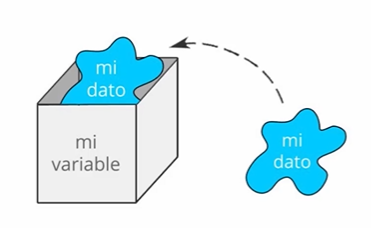
</div>

Asignar un valor a una variable dentro de R se hace mediante el par de signos <- quedando, por ejemplo:

```r
x <- 10
```

La función View nos muestra nuestro dataset en forma de tabla.

Operaciones básicas
```r
4 + 8
20 - 8
4^2
```

Algunos calculos
```r
oficina <- 7
estudio <- 1
transporte <- 1.5
tiempo <- oficina+estudio+transporte
tiempo

corte1 <- 0.3
corte2 <- 0.3
corte3 <- 0.4

nota1 <- 4
nota2 <- 4.6
nota3 <- 3

notac1 <- nota1*corte1
notac2 <- nota2*corte2
notac3 <- nota3*corte3

nota_final <- notac1 + notac2 + notac3
nota_final
```

## Tipos de datos con R
Es importante conocer la estructura de los datos para saber como trabajar con ellos
<div align="center">
  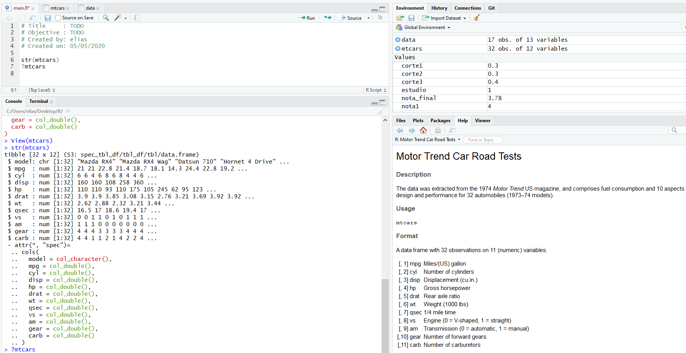
</div>

Cambios de tipos de datos
```r
str(mtcars)
?mtcars
class(mtcars$vs)
mtcars$vs = as.logical(mtcars$vs)
mtcars$am = as.logical(mtcars$am)
str(mtcars)
```

Resumen y transformaciones
```r
str(data)
?data
# Resumen del dataset
summary(data)
summary(mtcars)

# Transformar kilos en lugar de libras
wt <- (mtcars$wt*1000)/2
wt
# Transformación al dataset
mtcars.new <- transform(mtcars,wt=wt*1000/2)
mtcars.new
summary(mtcars.new)
```

## Vectores
Un **vector** es un ente matemático que se usa para guardar información de un mismo tipo, dentro de R se crean los vectores con la función c.

* **sum** es una función que como su nombre lo indica, retorna la suma de los valores que le indiquemos.

```r
# Vectores
t_estudio <- c(25,5,10,15,10)
t_lecturas <- c(30,10,5,10,15)
t_aprendizaje <- t_estudio + t_lecturas
t_aprendizaje

dias_aprendizaje = c("Lunes", "Martes", "Miercoles", "Jueves", "Viernes")
dias_aprendizaje

dias_mas_20min = c(TRUE, FALSE, FALSE,TRUE,TRUE)
dias_mas_20min

total_t_estudio = sum(t_estudio)
total_t_estudio
total_t_lecturas = sum(t_lecturas)
total_t_lecturas
total_t_adicional = total_t_estudio + total_t_lecturas
total_t_adicional
```

## Matrices

> Una matriz debe tener mismo tipo de datos, por otro lado, un dataframe puede tener diferentes.

Para crear una matriz en R utilizaremos la función matrix cuyos argumentos son:

* **la información** de los elementos.
* **nrow:** número de filas.
* **ncol:** número de columnas.
* **byrow:** booleano para indicar si llenar la matriz por filas.
* **colSums:** es una función que por argumento recibe una matriz y te retorna la suma de los valores de sus columnas.

<div align="center">
  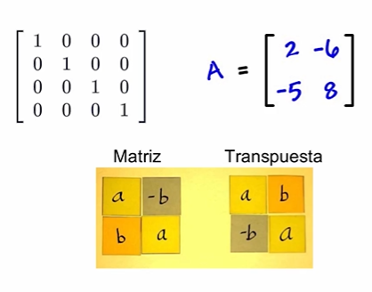
</div>

```r
# Matrices
t_estudio
t_lecturas
c(t_estudio, t_lecturas)
tiempo_matriz = matrix(c(t_estudio, t_lecturas), nrow = 2, byrow=TRUE)
tiempo_matriz

dias = c("Lunes", "Martes", "Miercoles", "Jueves", "Viernes")
tiempo = c("Tiempo estudio", "Tiempo lecturas")

colnames(tiempo_matriz) = dias
rownames(tiempo_matriz) = tiempo

tiempo_matriz
colSums(tiempo_matriz)
```

* **rbind**: función para añadir una fila.

Para seleccionar rápidamente un elemento de una matriz solamente debemos indicar entre corchetes el número de la fila y de la columna.

```r
t_estudio <- c(25,5,10,15,10,10)
t_lecturas <- c(30,10,5,10,15,25)
t_estudio
t_lecturas
c(t_estudio, t_lecturas)
tiempo_matriz <- matrix(c(t_estudio, t_lecturas), ncol =length(t_estudio), nrow = 3, byrow=TRUE)
tiempo_matriz

dias = c("Lunes", "Martes", "Miercoles", "Jueves", "Viernes", "Sabado")
tiempo = c("Tiempo estudio", "Tiempo lecturas", "Tiempo podcast")

colnames(tiempo_matriz) = dias
rownames(tiempo_matriz) = tiempo

tiempo_matriz
colSums(tiempo_matriz)

# Modificando la matriz
final_matrix = rbind(tiempo_matriz,c(10,15,30,5,0))
final_matrix
colSums(final_matrix)
final_matrix[1.5]
```

<div align="center">
  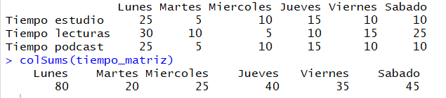
</div>

## Operadores de comparación y ubicación de datos

<div align="center">
  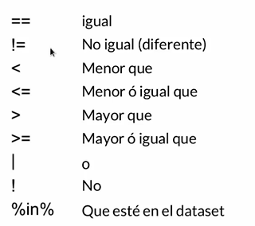
</div>

En R cuentas con los operadores de comparación comunes como == o |, pero además cuentas con el operador:

* **%in%** Que sirve para checar si un elemento se encuentra en el dataset

> Para hacer una selección de elementos de un vector, matriz o data frame podemos usar la función **subset**.

Podemos **renombrar una variable de nuestro dataset**, para ello debemos tener instalado el **paquete plyr**. En caso de no tener el paquete instalado solamente corremos en la consola el código ``install.packages("plyr")``.

```r
mtcars[mtcars$cyl<6,]
data[data$GDP.PC>=15000,]
data[data$Creat.Ind...GDP<=2,]
newOrange = subset(data, Internet.penetration...population > 80 & Education.invest...GDP >=4.5, select=Creat.Ind...GDP)
newOrange

install.packages('plyr')
plyr::rename(data,c("Creat.Ind...GDP" = "AporteEcNja"))
require('plyr')
data2 = rename(data,c("Creat.Ind...GDP" = "AporteEcNja"))
data2
data
```

## Factores y listas

* Un factor es un tipo de dato que tien variables categoricas o etiquetas
* Una lista puede almacenar cualquier tipo ded ato o estructura

```r
nivel_curso = c("Basio","Intermedio", "Avanzado")
nivel_curso
# Principio y final del dataset
head(mtcars)
head(data)
tail(mtcars)
tail(data)
# Visualizar estructura del dataset
install.packages("dplyr")
dplyr::glimpse(data)
# Listas
my_vector = 1:8
my_vector
my_matriz = matrix(1:9, ncol=3)
my_matriz
my_df = mtcars[1:4,]
my_df
my_list = list(my_vector,my_matriz,my_df)
my_list
```

# EDA: Exploratory Data Analysis

## Estadística

<div align="center">
  
</div>

<div align="center">
  
</div>

https://www.youtube.com/watch?v=W1_eCwuYkAI&t=316s

## EDA

Es la visualización de los datos antes de aplicar las formulas estadísticas

El **cuarteto de Anscombe** comprende cuatro conjuntos de datos que tienen las mismas propiedades estadísticas, pero que evidentemente son distintas al inspeccionar sus gráficos respectivos.

## Tipos de visualización en EDA
* **Histograma:** En estadística, un histograma es una representación gráfica de una variable en forma de barras, donde la superficie de cada barra es proporcional a la frecuencia de los valores representados. Sirve para ver la distribución de las frecuencias de una variable. Las barras van pegadas y el orden en el eje X es ascendente. En un histograma se presenta lo que hay y también lo que no hay.

<div align="center">
  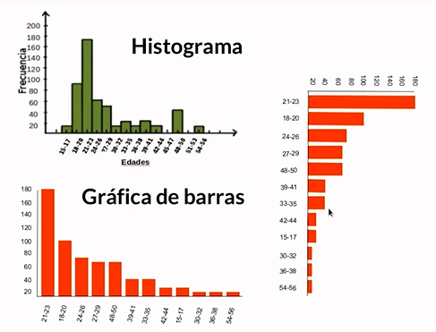
</div>

* **Diagrama de dispersión (Scatterplot):** Un diagrama de dispersión o gráfica de dispersión o gráfico de burbujas es un tipo de diagrama matemático que utiliza las coordenadas cartesianas para mostrar los valores de dos variables para un conjunto de datos. Las variables deben ser continuas o numéricas, los puntos no se pueden unir como si se hace en las gráficas de líneas

<div align="center">
  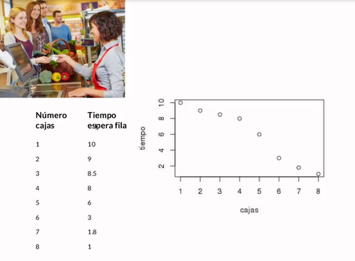
</div>

* **Diagrama de caja (Boxplot):** También conocido como diagrama de caja y bigote, box plot, box-plot o boxplot. Es un método estandarizado para representar gráficamente una serie de datos numéricos a través de sus cuartiles. De esta manera, el diagrama de caja muestra a simple vista la mediana y los cuartiles de los datos,​ pudiendo también representar los valores atípicos de estos.

<div align="center">
  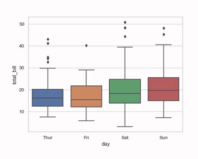
</div>

## Interpretación del Boxplot

Los 5 puntos clave en estadística descriptiva se pueden visualizar en el box plot:

* **Primer cuartil:** es el piso de la caja o línea inferior.
* **Tercer cuartil:** es el techo de la caja o línea superior.
* **Mediana:** es la línea que se encuentra dentro de la caja.
* **Mínimo:** la extensión inferior de la caja.
* **Máximo:** la extensión superior de la caja.

Ejemplo:
Para entender cómo se compone un Boxplot
<div align="center">
  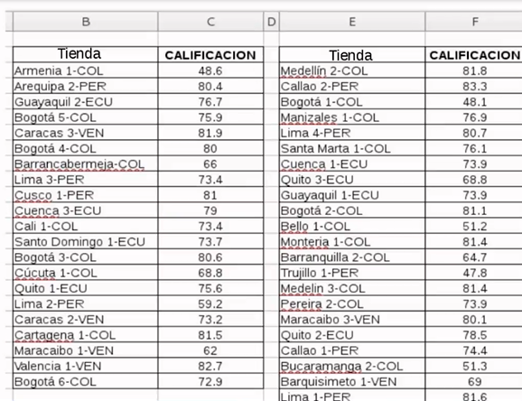
</div>
<div align="center">
  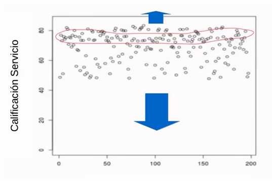
</div>
<div align="center">
  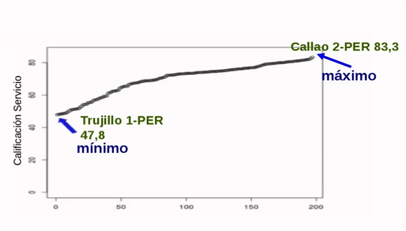
</div>
<div align="center">
  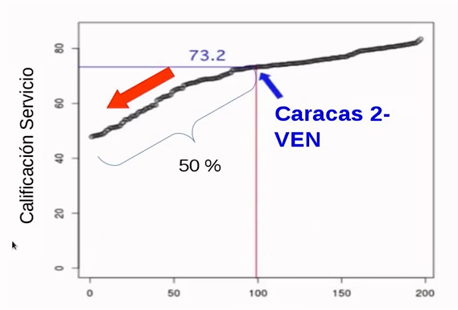
</div>
<div align="center">
  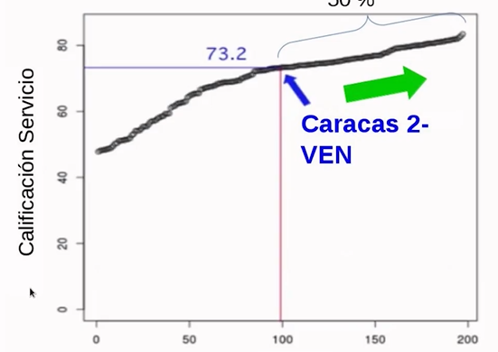
</div>
<div align="center">
  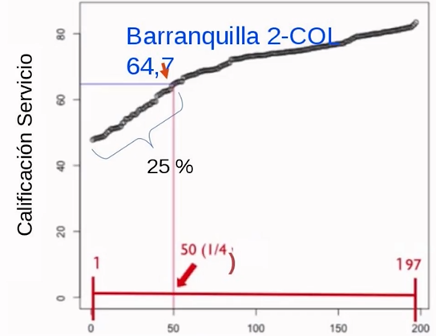
</div>
<div align="center">
  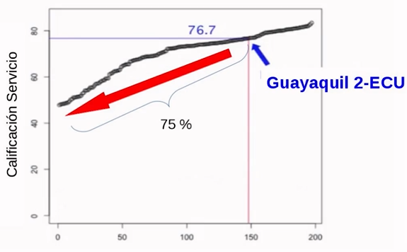
</div>
<div align="center">
  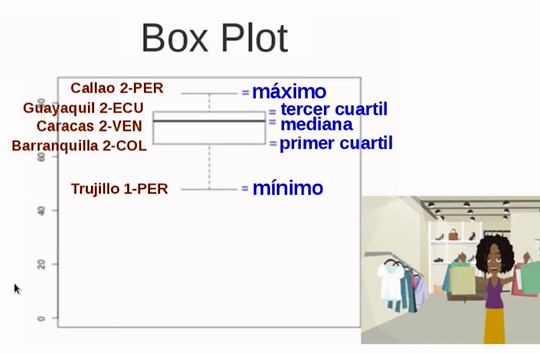
</div>
<div align="center">
  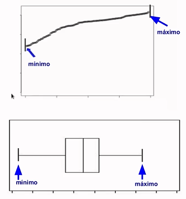
</div>

## EDA En código

### Diagramas de dispersión

Para realizar EDA con una gráfica de dispersión dentro de R debemos utilizar la **función plot**, los argumentos que debemos pasarle son:

* la información en el eje X y Y.
* **xlab:** título para el eje x.
* **ylab:** título para el eje y.
* **main:** título de la gráfica.

```r
# EDA Scatter plot
plot(mtcars$mpg ~ mtcars$cyl, 
     xlab="cilindros", 
     ylab ="millas por galon", 
     main="Relacion cilindros y millas por galon"
)

plot(mtcars$mpg ~ mtcars$hp, 
     xlab="caballos de fuerza", 
     ylab ="millas por galon", 
     main="Relacion caballos de fuerza y millas por galon"
)

plot(data$Unemployment ~ data$Education.invest...GDP,
  xlab="Inversión educacion (%PIB)", 
  ylab="Desempleo", 
  main="Relación inversión en educación y desempleo"
)

plot(data$GDP.PC ~ data$Creat.Ind...GDP,
     xlab="Aporte economía naranja (%PIB)", 
     ylab="PIB Per capita", 
     main="Relación economía naraja y pib per capita"
)
```

#### Visualización de datos con ggplot

https://rstudio.com/wp-content/uploads/2015/04/ggplot2-spanish.pdf

Además, podemos crear histogramas con el paquete **ggplot2** para ello debemos instalarlo:

``install.packages("ggplot2")``

### Histogramas

Para realizar EDA con un histograma dentro de R debemos utilizar la función qplot, los argumentos que debemos pasarle son:

la información en el eje X.
* **geom:** describir el tipo de gráfica que se va a imprimir.
* **xlab:** título para el eje x.
* **main:** título de la gráfica.

```r
install.packages("ggplot2")
require("ggplot2")
qplot(mtcars$hp,
      geom="histogram",
      xlab="Caballos de fuerza",
      main="Carros según caballos de fuerza")

ggplot(mtcars, aes(x=hp))+
  geom_histogram(binwidth = 30)+
  labs(x="Caballos de fuerza", y="Cantidad de carros", title="Caballos de fuerza en carros seleccionados")+
  theme(legend.position = "none")+
  theme(panel.background = element_blank(), panel.grid.major = element_blank(), panel.grid.minor = element_blank())

ggplot()+
  geom_histogram(data=mtcars,aes(x=hp), fill="blue", color="red", binwidth = 20)+
  labs(x="Caballos de fuerza", y="Cantidad de carros", title="Caballos de fuerza en carros seleccionados")+
  xlim(c(80,280))+
  theme(legend.position = "none")+
  theme(panel.background = element_blank(), panel.grid.major = element_blank(), panel.grid.minor = element_blank())

ggplot()+
  geom_histogram(data=data,
                 aes(x=GDP.PC), 
                 fill="blue", 
                 color="red", 
                 binwidth = 2000)+
  labs(x="PIB Percapita", 
       y="Cantidad de países",
       title="PIB per cápita en países de LATAM")+
  theme(legend.position = "none")+
  theme(panel.background = element_blank(), panel.grid.major = element_blank(), panel.grid.minor = element_blank())

ggplot()+
  geom_histogram(data=data,
                 aes(x=Creat.Ind...GDP), 
                 fill="blue", 
                 color="red", 
                 binwidth = 1)+
  labs(x="Aporte economía naranja al PIB (%)", 
       y="Cantidad de países",
       title="Contribución economía naranja al PIB en países de latinoamerica")+
  theme(legend.position = "none")+
  theme(panel.background = element_blank(), panel.grid.major = element_blank(), panel.grid.minor = element_blank())

ggplot()+
  geom_histogram(data=data,
                 aes(x=Internet.penetration...population), 
                 fill="red", 
                 color="yellow", 
                 binwidth = 5)+
  labs(x="Penetración internet (%) población", 
       y="Cantidad de países",
       title="Penetración de internet en países de LATAM")+
  theme(legend.position = "none")+
  theme(panel.background = element_blank(), panel.grid.major = element_blank(), panel.grid.minor = element_blank())+
  scale_x_continuous(breaks = seq(40,100,5))
```

### Boxplot

```r

boxplot(mtcars$hp, 
        ylab="Caballos de fuerza",
        main="Caballos de fuerza en carros mtcars")

ggplot(mtcars,aes(x=as.factor(cyl),y=hp, fill=cyl))+
geom_boxplot(alpha=0.6)+
  labs(x="cilindros", 
       y="caballos de fuerza",
       title="caballos de fuerza según cilindros en mtcars")+
  theme(legend.position = "none")+
  theme(panel.background = element_blank(), 
        panel.grid.major = element_blank(), 
        panel.grid.minor = element_blank())

mtcars$am <- factor(mtcars$am, levels=c(TRUE, FALSE),
                    labels=c("Manual","Automatico"))

ggplot(mtcars, aes(x=am, y=mpg, fill=am))+
  geom_boxplot()+
  labs(x="Tipo de caja", y="Millas por galon", title="Millas por galon según tipo de caja")+
  theme(legend.position = "none")+
  theme(panel.background = element_blank(), 
        panel.grid.major = element_blank(), 
        panel.grid.minor = element_blank())
```

## Dplyr

```r
economy = mean(data$GDP.PC)
economy
install.packages("dplyr")
require("dplyr")
data = data %>%
  mutate(Strong_economy = ifelse(GDP.PC < economy, 
                                 "Por debajo del promedio pib per capita",
                                 "Sobre arriba promedio pib per capita"))

ggplot(data, aes(x=Strong_economy,y=Creat.Ind...GDP,
                 fill=Strong_economy))+
  geom_boxplot(alpha=0.4)+
  labs(x="Tipo de país", 
       y="Aporte de economía naranja al pib",
       title="Aporte economía naranja en pib países latam con alto y bajo pib per capita")+
  theme(legend.position = "none")+
  theme(panel.background = element_blank(), 
        panel.grid.major = element_blank(), 
        panel.grid.minor = element_blank())

ggplot(data, aes(x=Strong_economy,y=Internet.penetration...population,
                 fill=Strong_economy))+
  geom_boxplot(alpha=0.4)+
  labs(x="Tipo de país", 
       y="Penetración de internet",
       title="Penetración de internet en países latam con alto y bajo pib per capita")+
  theme(legend.position = "none")+
  theme(panel.background = element_blank(), 
        panel.grid.major = element_blank(), 
        panel.grid.minor = element_blank())
```

## Gráficas de dispersión

```r
ggplot(mtcars, aes(hp,mpg))+
  geom_point()+
  labs(x="Caballos de fuerza", 
       y="Millas por galón",
       title="Relación caballos de fuerza y millas por galón")+
  theme(legend.position = "none")+
  theme(panel.background = element_blank(), 
        panel.grid.major = element_blank(), 
        panel.grid.minor = element_blank())

ggplot(mtcars, aes(wt,hp))+
  geom_point()+
  labs(x="Peso", 
       y="Potencia",
       title="Relación peso-potencia")+
  theme(legend.position = "none")+
  theme(panel.background = element_blank(), 
        panel.grid.major = element_blank(), 
        panel.grid.minor = element_blank())

```

## Gráficas interactivas
```r
install.packages("devtools")
require("devtools")
require("plotly")
require("ggplot2")

data = data %>%
  mutate(Strong_economy = ifelse(GDP.PC < economy, 
                                 "Por debajo del promedio pib per capita",
                                 "Sobre arriba promedio pib per capita"))


ggplot(data, aes(Education.invest...GDP,Unemployment))+
  geom_point(aes(color=factor(Strong_economy), size=X..pop.below.poverty.line))+
  labs(x="Inversión en educación % PIB",
       y="Desempleo",
       title="Inversión en Educación y desempleo según economía y
       población por debajo de la línea de pobreza")

graph = ggplot(data, aes(Internet.penetration...population,
                         Creat.Ind...GDP,label=row.names(data)))+
geom_point()+
labs(x="Penetración internet",
     y="Aporte economía naranja",
     title="Penetracion Internet y aporte economía")
graph
p = plotly::ggplotly(graph)
p
```

# Estadística con R

**La función pairs nos permite cruzar todas las variables del dataset** a modo de tabla donde el eje x de una gráfica corresponde a la columna donde se encuentra y el eje y a la fila.

* **select:** función para seleccionar variables o columnas.
* **filter:** función para filtrar datos de un dataset, retorna las filas que pasen el filtro.

* Correlación negativa: A más de X, menos de Y
* Correlación positiva: A más de Y, menos de X

<div align="center">
  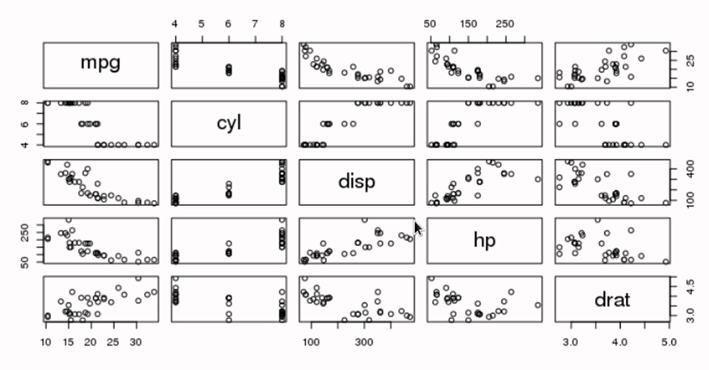
</div>

```r
#
pairs(mtcars[,2:6])
require("dplyr")

# Subconjunto
newdata = subset(mtcars, select=c(2,7:8,11,12))
pairs(newdata)


pairs(mtcars[,-c(1,3,4,5,6,9,10)])

Eficientes = filter(mtcars, mpg >= 30)
Eficientes
pairs(Eficientes[,2:6])

require("stringr")

merc = mtcars %>%
  filter(str_detect(model,"Merc"))
merc
pairs(merc[,2:6])
```

**La función cor nos retorna la correlación entre los datos.** Recordemos que el valor de una correlación va de -1 a 1, si se acerca a 0 no hay correlación.

```r
cor(mtcars[,2:6])
cor(newdata)
cor(merc[,2:6])
```

```r
# Proyecto
pairs(data[,2:6])
pairs(data[,5:10])

newdata = subset(data, select = c(5,6,10,11,12,13))
newdata
pairs(newdata)

cor(data[,2:6])
cor(data[,2:6], use="complete.obs")
cor(data[,5:10], use="complete.obs")
cor(newdata, use="complete.obs")
```

## Protegiendonos de los peligros del promedio (Desviación estándar)

Podremos encontrar casos donde dos grupos de datos distintos tengan el mismo promedio, pero sus datos son muy diferentes uno del otro. **No es lo mismo un grupo de datos donde su desviación es menor a 1, que aquel donde sus datos tienen una desviación de 4 o 6 puntos.**

<div align="center">
  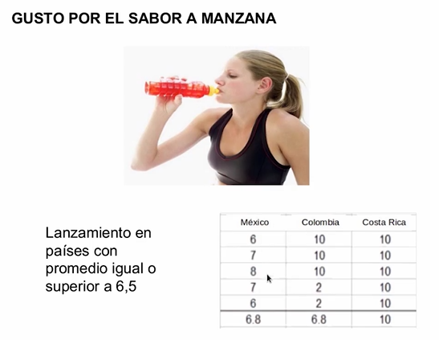
</div>

<div align="center">
  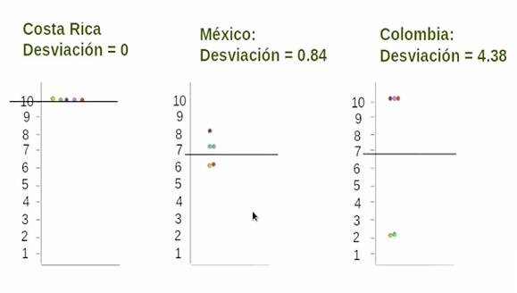
</div>

**La formula del coeficiente de variación nos es útil al momento de evaluar estos casos:** (desviación estándar)/(promedio) * 100 = coeficiente

<div align="center">
  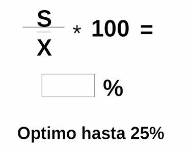
</div>

> Si el coeficiente es mayor al 25% entonces los datos no son homogéneos, varían mucho.

Dentro de R podemos sacar la desviación estándar con la función sd y el promedio con mean.

```r
# Promedios
summary(mtcars)
#Promedio
prom = mean(mtcars$mpg)
prom
# Desviación
desv = sd(mtcars$mpg)
desv
coef = desv/prom*100
coef
```

Eliminar los NAs
```r
# Promedios
summary(data)
#Promedio
prom = mean(data$Internet.penetration...population)
prom
# Desviación
desv = sd(data$Internet.penetration...population)
desv
# Coeficiente
coef = desv/prom*100
coef
# Remover NAs
prom = mean(data$Creat.Ind...GDP, na.rm = TRUE)
prom
# Desviación
desv = sd(data$Creat.Ind...GDP, na.rm = TRUE)
desv
# Coeficiente
coef = desv/prom*100
coef
```

## Estadística y visualización aplicada a análisis de datos de mercadeo.

https://medium.com/@soniaardila1/c%C3%B3mo-escogemos-nuestra-nave-espacial-una-c%C3%B3smica-historia-de-mercadeo-e26f5599263d

# Transformaciones y ajustes de datos
```r
# Ajustar para mejorar visualizaciones
eficientes = mean(mtcars$mpg)
eficientes

# Transformando el dataset
mtcars = mtcars %>%
  mutate(Mas_eficientes=ifelse(mpg<eficientes,
                               "Bajo promedio",
                               "En ó sobre promedio"))

# Selección carros más veloces
Mas_veloces = mtcars[mtcars$qsec<16,]
Mas_veloces
mtcars = mtcars %>%
  mutate(Velocidad_Cuarto_milla=ifelse(qsec<16,
                                       "Menos 16 segundos",
                                       "Más de 16 segundos"))

mtcars = mtcars %>%
  mutate(Peso_kilos=(wt/2)*1000)

mtcars = mtcars %>%
  mutate(Peso=ifelse(Peso_kilos <= 1500,
                     "Livianos","Pesados"))
```

En el proyecto

```r
# Ajustes al proyecto
data = data %>%
  mutate(Crecimiento_GDP = ifelse(GDP.Growth.. >= 2.5,
                                  "25% o más",
                                  "Menos de 2.5%"))
data = data %>%
  mutate(Anaranjados=ifelse(Creat.Ind...GDP >= 2.5,
                            "Mas anaranjados",
                            "Menos anaranjados"))
# Ranking
data %>%
  arrange(desc(Creat.Ind...GDP))

TopNaranjas = data %>%
  filter(Country %in% c("Mexico","Panama","Argentina","Colombia","Brazil"))
TopNaranjas

TopNaranjas %>%
  arrange(desc(Creat.Ind...GDP))

# Otra forma de Rankear
top <-top_n(data,5,Creat.Ind...GDP)[,] 
top
top <- top %>% arrange(desc(top$Creat.Ind...GDP))
top

```

# Mejora de visualizaciones
```r
# Visualizaciones
mtcars %>%
  arrange(desc(Peso_kilos))
Top_pesados = top_n(mtcars,5,Peso_kilos)
Top_pesados
Mas_pesados = mtcars %>%
  filter(model %in% Top_pesados$model)
Mas_pesados


ggplot(Mas_pesados, aes(x=hp, y=mpg))+
  geom_point()+
  facet_wrap(~model)

ggplot(mtcars, aes(x=cyl, y=mpg, size=Peso))+
  geom_point()+
  facet_wrap(~am)

ggplot(mtcars, aes(x=cyl, y=mpg, size=Peso_kilos))+
  geom_point()+
  facet_wrap(~am)

ggplot(top, aes(x=Internet.penetration...population,
                y=Services...GDP,size=GDP.PC))+
  geom_point()+
  facet_wrap(~Country)

ggplot(TopNaranjas, aes(x=Education.invest...GDP,
                y=Creat.Ind...GDP,size=Unemployment))+
  geom_point()+
  facet_wrap(~Country)

install.packages("RColorBrewer")
require("RColorBrewer")
require("ggplot2")

myColors = brewer.pal(9,"Reds")
ggplot(TopNaranjas, aes(x=Internet.penetration...population,
                y=GDP.PC,fill=Creat.Ind...GDP))+
  geom_tile()+
  facet_wrap(~Country)+
  scale_fill_gradientn(colors=myColors)

```

# R Markdown

# Relaciones
```r
cajas = c(1,2,3,4,5,6,7,8)
tiempo = c(10,9,8,5.8,6,3,1.8,1)
plot(tiempo~cajas)

plot(data$Services...GDP~data$Education.invest...GDP)
plot(mtcars$mpg~mtcars$am)
```