# Scrum<!-- omit in toc -->

## Tabla de Contenido<!-- omit in toc -->
- [Certificación oficial](#certificación-oficial)
- [¿Qué es agile?](#qué-es-agile)
  - [Principales marcos](#principales-marcos)
  - [Centrado en las personas](#centrado-en-las-personas)
  - [Manifiesto ágil](#manifiesto-ágil)
  - [Desarrollo tradicional vs agile](#desarrollo-tradicional-vs-agile)
  - [Manifiesto ágil](#manifiesto-ágil-1)
    - [Principios ágiles](#principios-ágiles)
    - [12 principios agiles](#12-principios-agiles)
- [Introducción a Scrum](#introducción-a-scrum)
  - [Resolver cualquier problema](#resolver-cualquier-problema)
  - [Escencia](#escencia)
  - [Teoría de Scrum](#teoría-de-scrum)
  - [Pilares de Scrum](#pilares-de-scrum)
  - [Valores](#valores)
  - [Componentes de Scrum](#componentes-de-scrum)
    - [El equipo](#el-equipo)
    - [Roles](#roles)
    - [Eventos en scrum](#eventos-en-scrum)
    - [Artefactos de scrum](#artefactos-de-scrum)
- [Roles en scrum](#roles-en-scrum)
  - [El equipo de scrum](#el-equipo-de-scrum)
    - [Forma tu equipo de Scrum](#forma-tu-equipo-de-scrum)
  - [Presentando al dueño del producto o product owner (Capitan del barco)](#presentando-al-dueño-del-producto-o-product-owner-capitan-del-barco)
  - [Rol del scrum master](#rol-del-scrum-master)
  - [La base del equipo de desarrollo](#la-base-del-equipo-de-desarrollo)
- [Artefactos Scrum](#artefactos-scrum)
  - [Épicas y backlog del producto](#épicas-y-backlog-del-producto)
  - [¿Qué nos cuentan las historias de usuario?](#qué-nos-cuentan-las-historias-de-usuario)
  - [Componentes de la historia de usuario](#componentes-de-la-historia-de-usuario)
  - [Estimar historias de usuario](#estimar-historias-de-usuario)
  - [Poker de planeación](#poker-de-planeación)
  - [¿Por dónde comenzar?Prioridades y backlog del sprint](#por-dónde-comenzarprioridades-y-backlog-del-sprint)
  - [Midiendo el avance del proyecto](#midiendo-el-avance-del-proyecto)
- [Entender y realizar las ceremonias](#entender-y-realizar-las-ceremonias)
  - [El Sprint](#el-sprint)
  - [Planeando el sprint](#planeando-el-sprint)
  - [Seguimiento del proyecto (Daily Stand-up)](#seguimiento-del-proyecto-daily-stand-up)
  - [Refinando historias](#refinando-historias)
  - [Demos y retrospectivas](#demos-y-retrospectivas)
  - [Retrospectiva](#retrospectiva)
- [Crecer usando scrum](#crecer-usando-scrum)
  - [Escalabilidad](#escalabilidad)
  - [Comunidades de práctica](#comunidades-de-práctica)

# Certificación oficial

https://certiprof.com/pages/scrum-foundations-professional-certificate-sfpc-spanish

# ¿Qué es agile?

Es la habilidad para crear productos y **responder al cambio**

* Conjunto de marcos de trabajo
* Metodologías

## Principales marcos

* Kanban
* Scrum
* TDD
* Extremme Programming

https://www.scrummanager.net/bok/index.php?title=Principales_modelos_y_marcos_%C3%A1giles

## Centrado en las personas

* Como colaboran y trabajan entre sí

## Manifiesto ágil

  

## Desarrollo tradicional vs agile

**Tradicional**

* Dificultades de saber quien está trabajando en que
* Equipos grandes 
* Lista grande de requerimientos
* El valor llegaba al final

**Ágil**

* Tiempo corto de desarrollo
* Iteraciones
* Equipos cortos
* Listas pequeñas de requerimientos, desarrollando por iteraciones
* Valor constante
* Cambios pequeños y constantes

## Manifiesto ágil

http://agilemanifesto.org/iso/es/manifesto.html

### Principios ágiles

  

### 12 principios agiles

* **Satisfacción al cliente**
  * Entregas tempranas y continuas de software con valor
* **Cambios**
  * Los cambios son bienvenidos en cualquier etapa del proyecto
* **Software funcional**
  * Se entrega frecuentemente, en periodos de tiempo cortos
* **Colaboración**
  * Negocio y desarrolladores trabajamos juntos
* **Individuos motivados**
  * Se debe dar un buen entorno y confianza al equipo de desarrollo
* **Comunicación cara a cara**
  * Es el método más eficiente y efectivo de comunicación con el equipo
* **Progreso**
  * El software funcionando es la medida principal de progreso
* **Desarrollo sostenible**
  * El ritmo de desarrollo debe ser constante de forma indefinida
* **Mejora continua**
  * A través de excelencia técnica y buen diseño
* **Simplicidad**
  * El arte de maximizar la cantidad de trabajo no realizado es escencial
* **Autoorganización**
  * Las mejores arquitecturas, requisitos y diseños emergen de equipos autoorganizados
* **Autoevaluación**
  * El equipo es capaz de ajustar y perfeccionar su comportamiento

# Introducción a Scrum

Colaborar por un objetivo en común

  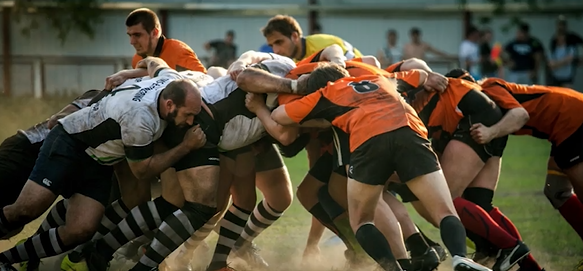

Es un **marco de trabajo** por el cual las personas pueden abordar problemas complejos adaptativos, a la vez que entregan productos del maximo valor posible productiva y creativamente

## Resolver cualquier problema

* Software
* Educación
* Casa
* Gobierno

## Escencia

* Equipo pequeño de personas
* Flexible y adaptativo
* 5-7 de personas

## Teoría de Scrum

Control de procesos **empírica o empirismo**. El empirismo asegura que el conocimiento procede de la experiencia y de tomar decisiones basándose en lo que se conoce

* Fases delimitadas en el tiempo
  * Planeación
  * Iteración
  * Entrega de producto funcional

## Pilares de Scrum

* Transparencia
* Inspección
* Adaptación 

## Valores

* **Compromiso** de los miembros para cumplir los objetivos marcados
* **Corage**, cualquiera tiene la capacidad de realizar una tarea y es respaldado por el equipo
* **Enfoque**, cada miembro está enfocado en cumplir el objetivo
* **Apertura**, escuchar a los miembros involucrados en el proceso
* **Respeto**, todos somos parte del mismo equipo, respetar las ideas y las soluciones de las demás personas

## Componentes de Scrum

### El equipo

* Autoorganizado
* Multifuncional

### Roles

* **Dueño del producto (Product Owner)**
  * Responsable de maximizar el valor del producto
  * Cara del cliente frente al equipo/dentro del equipo de scrum
* **Scrum Master**
  * Responsable de promover y apoyar scrum
  * Experto en Scrum
* **Equipo de desarrollo** (Development Team)
  * Profesionales que realizan el trabajo de entregrar un incremento de producto "Terminado"

### Eventos en scrum

Eventos predefinidos con el fin de crear regulatidad y minimizar la necesidad de reuniones no definidas en scrum

* **Sprint**
  * Es el corazón de Scrum donde se crea un incremento del producto
* **Planificación del Sprint (Sprint planning)**
  * Ceremonia para definir que se hará durante el sprint
* **Scrum diario (Daily Stand-Up)**
  * Reunión diaria de todo el equipo de desarrollo
* **Revisión del sprint (Sprint review)**
  * Es donde se muestra el incremento desarrollado durante el sprint
* **Retrospectiva de Sprint (Sprint retrospective)**
  * Oportunidad para aplicar mejora continua

### Artefactos de scrum

Representan el trabajo o valor en diversas formas que son útiles para proporcionar transparencia y oportunidades para la inspección y adaptación

* **Lista de producto (Product Backlog)**
  * Es una lista ordenada de todo lo que se conoce que es necesario en el producto
* **Lista de pendientes del Sprint (Sprint Backlog)**
  * Elementos de la lista de producto seleccionados del sprint

  

# Roles en scrum

## El equipo de scrum

Se busca optimizar la flexibilidad, creatividad y productividad

* **Product Owner**
  * La persona que entiende los requerimientos y lo que quiere el cliente
  * Gestiona los requisitos
  * Atiende peticiones del cliente
  * Dueño del producto
  * Sabe las reglas y procesos del negocio
* **Scrum master**
  * Sabe el proceso
  * Elimina impedimientos
  * Promueve y apoya scrum
  * Implementa la metodología
* **Equipo de desarrollo**
  * Realizan el trabajo a entregar
  * Auto-organización
  * Auto-gestión
  * Incrementos constantes del producto

Se busca optener retroalimentación del cliente constantemente

* **Dependencias**
  * Es ideal organizar los equipos pensando en minimizar las dependencias con entes externos
* **Tipos de organización**
  * Los equipos se pueden organizar con base en **funcionalidades** o **componentes**

### Forma tu equipo de Scrum

Formar tu equipo es muy fácil. Ten en cuenta los siguientes tips y empieza tus proyectos con el pie derecho.

1. Arma tu equipo con todos los perfiles profesionales que necesitas para desarrollar tu proyecto **(Dueño del producto, scrum master y equipo de desarrollo)** 
2. Equipo de 3-9 personas, pequeño y flexible
3. Asegurate de tener todos los roles de SCRUM
4. Sesiones diarias de máximo 15 minutos con un objetivo específico

## Presentando al dueño del producto o product owner (Capitan del barco)

Es el responsable de **maximizar el valor del producto** resultante del trabajo del equipo de desarrollo. Representante del producto. Toma decisiones en caso de que el cliente no esté

**Responsabilidades**

* Expresar claramente los elementos de la lista del producto
* Dar prioridad a los elementos de la lista de producto
* Optimizar el valor del trabajo del equipo de desarrollo
* Asegurarse que la lista del producto sea visible, transparente y clara
* Asegurarse que el equipo de desarrollo conoce los elementos de la lista de producto

Las decisiones del diseño del producto se reflejan en el contenido y en la priorización de la lista del producto
Nadie puede forzar al equipo de desarrollo a que trabaje con base en un conjunto diferente de requisitos

## Rol del scrum master

Es responsable de promover y apoyar scrum ayudando a todos a entender la teoría, práctica, reglas y valores de scrum

* Es un líder que está al servicio del Equipo de Scrum
* Ayuda a las personas externas al equipo a entender que interacciones con el equipo scrum pueden ser útiles y cuáles no
* Asegurar que los objetivos, el alcance y el dominio del producto sean entendidos por todos en el equipo de la mejor manera posible
* Entender y prácticar la agilidad
* Facilitar los eventos de Scrum según requiera o necesite
* Guiar al equipo de desarrollo en ser autoorganizado y multifuncional
* Ayuda al equipo de desarrollo a crear productos de algo valor
* Elimina impedimentos para el progreso del equipo de desarrollo
* Está al servicio de toda la organización
* Liderar y guiar a la organización en la adopción de scrum
* Trabajar con otros scrum masters para incrementar la efectividade de la aplicación de scrum en la organización

## La base del equipo de desarrollo

  

Consiste en los profesionales que realizan el trabajo de entregar un incremento de producto **"Terminado"** que potencialmente se pueda poner en producción al final de cada Sprint

* La organización es la encargada de estructurar y empoderar a los equipos para que organicen y gestionen su propiio trabajo

**Caracteristicas**

* Autoorganizados
* Multifuncionales
* No tienen títulos
* No hay subequipos
* Solo se puede modificar al terminar el sprint

  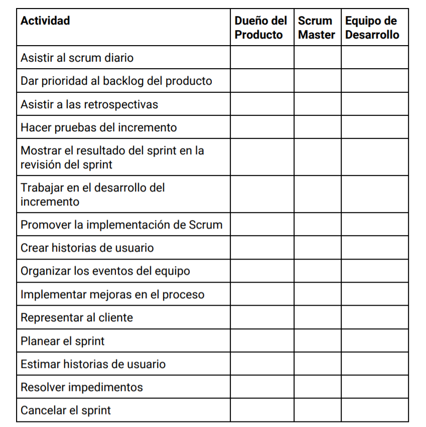

# Artefactos Scrum

## Épicas y backlog del producto

Es una lista ordenada de todo lo que se conoce que es necesario en el producto.

* Es la única fuente de requisitos para cualquier cambio a realizarse en el producto
* La lista de producto nunca está completa, siempre se va desarrollando a medida que avanza el proyecto
* Los elementos en la lista más prioritarios tienen descripciones más completas

  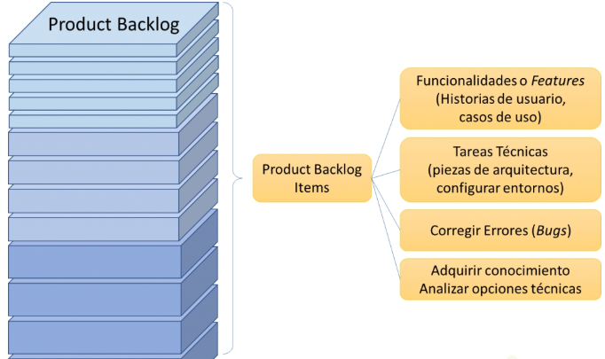

* La lista es dinámica; cambia constantemente para identificar lo que el producto necesita para ser adecuado, competitivo y útil
* Es un artefacto vivo, es decir, está cambiando constantemente y en ella residen todos los elementos necesarios para completar el producto
* Los elementos de la lista del producto se denominan como historias de usuario
* Todas las historias de usuario se pueden agrupar en elementos más grandes denominados Épicas
* Las épicas se pueden crear en base a **funcionalidades o módulos** del producto que se está desarollando
* Estás épicas normalmente requieren más de un Sprint para ser completadas

  

## ¿Qué nos cuentan las historias de usuario?

Son los elementos más específicos de la lista del producto, contienen la visión del usuario sobre la funcionalidad esperada del producto

* El usuario puede ser otra parte del sistema

## Componentes de la historia de usuario

* Título
* Descripción
* Puntos
* Criterio de aceptación

  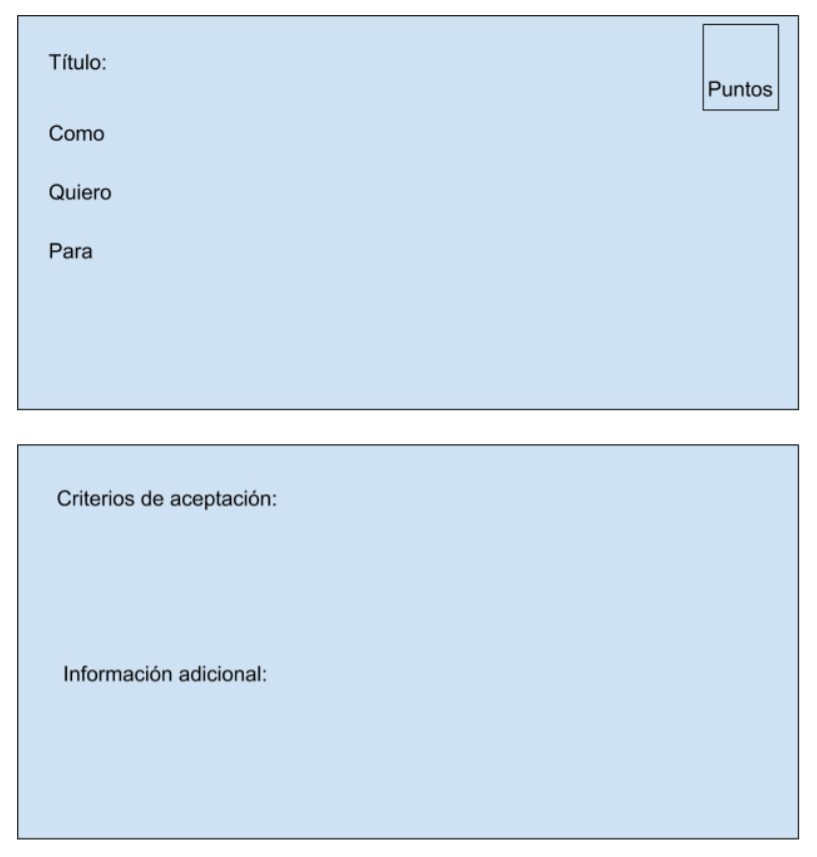

Ejemplo

  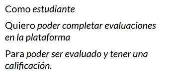

La definición de completo son la lista de elementos requeridos para saber que una historia está completa

* Funcionalidad (Criterios de aceptación)
* Código subido en git
* Pruebas creadas
* Documentación

**Invirtiendo en historias**

* Cards (Tarjetas)
* Conversación
* Confirmación

**Críterios**

* Independiente
* Negociable
* Valiosa
* Estimable
* Small (Pequeña)
* Testeable (Comprobable)

## Estimar historias de usuario

Los puntos de una historia son un número que representa varias cosas:

* Complejidad de la historia
* Cantidad de trabajo requerido
* Conocimientos necesarios
* Incertidumbre

Los valores de los puntos no tienen conexión con ninguna unidad de medida específica

## Poker de planeación

Sirva para que todo el equipo participe en la estimación de las historias

Puede utilizar distintas escalas:

* Fibonacci modificado (1,2,3,5,8,13,20,40,100)
* 2^n (1,2,4,8,16,32)

**Velocidad**

* Es el total de puntos de las historias de usuario completados por el equipo durante un sprint

**Capacidad**

Total de historias de usuario que se pueden completar en un sprint futuro

**Video**

https://platzi.com/clases/1750-scrum/24286-estimar-historias-de-usuario/

## ¿Por dónde comenzar?Prioridades y backlog del sprint

Backlog del Sprint

* Es un subconjunto de la lista del producto y contiene todos los elementos que serán desarrollados durante el Sprint
* De estos elementos dependerá el incremento a desarrollar y los objetivos del Sprint

  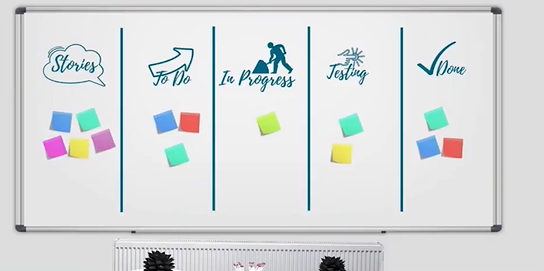

* Este plan debe tener detalle suficiente como para que todo el equipo sea capaz de comprenderlo en los daily stand-ups (scrum diario)
* Solo el equipo de desarrollo puede aceptar que se agreguen elementos al sprint backlog
* Si un elemento se vuelve innecesario a mitad de un sprint se puede sacar de la lista de pendientes

  

## Midiendo el avance del proyecto

En cualquier momento del sprint el equipo puede analizar el progreso hecho y revisar si aún se puede cumplir el objetivo planeado al inicio de la iteración

**Burn Down Chart**

  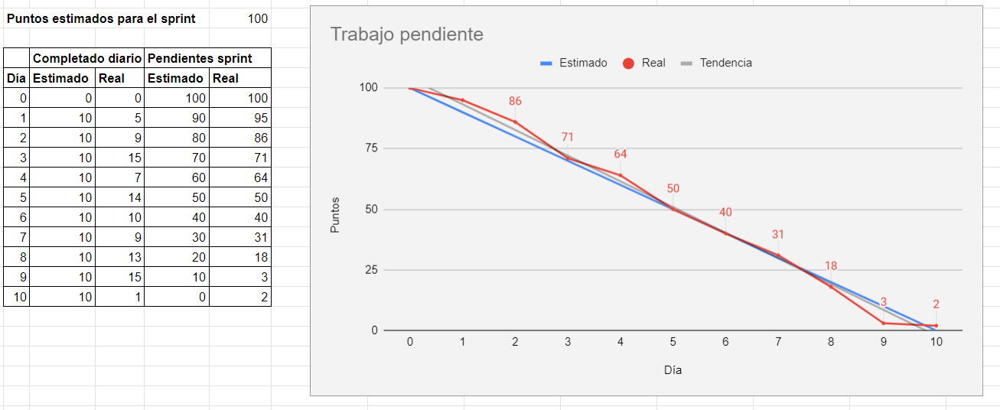

**Burn Up Chart**

  

**Cumulative flow**

  

# Entender y realizar las ceremonias

## El Sprint

Es el corazón de Scrum, es un período de tiempo determinado en que se crea un incremento de producto

  

* Objetivo claro
* Cualquier cambio dentro del sprint debe ser negociado entre el product owner y el equipo de desarrollo
* Si los objetivos del sprint quedan obsiletos este podría ser cancelado
* Solo el product owner tiene la autoridad para cancelar un sprint
* Es muy poco común cancelar un sprint
  
## Planeando el sprint

* Se planifica todo el trabajo del sprint
* Debe estar presente todo el equipo de scrum
* No debe durar más de 8 horas (Sprints de 4 semanas)
* El scrum master organiza la ceremonia
* Nadie responde correos ni mensajes

Responder preguntas

* ¿Qué podemos entregar al final del Sprint?
  * Se trabajan los elementos más prioritarios de la Lista del Producto
  * Se discute también el objetivo a lograr en el sprint
  * Se necesita saber la capacidad del equipo y la velocidad de la última iteración
* ¿Cómo se logrará hacer ese trabajo?
  * Los elementos de la lista de producto seleccionados para el sprint se analizan y se mueven a la lista de pendientes del sprint
  * Durante este proceso se hacen las estimaciones de esfuerzos
  * EL product owner se encargara de aclarar cualquier duda con algún elemento del Backlog
  * Pueden haber invitados que aporten valor a la discusión de las funcionalidades

  

## Seguimiento del proyecto (Daily Stand-up)

* No más de 15 min del equipo de desarrollo
*  utiliza para planear las próximas 24 horas de trabajo
*  El scrum master ayuda a programar la reunión en el mismo lugar y hora todos los días
*  Otras personas pueden estar presentes pero no participan
*  Optimiza la colaboración entre los miembros del equipo
*  Ayuda para medir el progreso para cumplir el objetivo del sprint

**Tres prguntas**

* ¿Qué hice ayer?
* ¿Qué haré hoy?
* ¿Tengo algún impedimento?

Si existen impedimentos el scrum master sera el encargado de ayudar a resolverlos
Si se necesitan más detalles sobre lo discutido, el equipo puede reunirse de ser necesario

**Video**

https://platzi.com/clases/1750-scrum/24291-el-seguimiento-del-proyecto-daily-stand-up/

## Refinando historias

Dentro de los procesos de Scrum es altamente deseado siempre tener funcionalidad en la lista de producto listas para implementación

* Se recomienda tener al menos una sesión para refinar historias durante el sprint
* Está reunión es organizada por el scrum master y pueden participar todos los miembros del equipo dedesarrollo. El product owner siempre está presente
* El objetivo de refinamiento de historias es poder tomar las funcionalidades a trabajar en el siguiente sprint y detectar cualquier posible duda o impedimento antes de comenzar el sprint

## Demos y retrospectivas

La revisión de sprint ocurre siempre al final del sprint en ella se demuestran los avances de la iteración y el producto funcional que se contruyo

**Retroalimentación rápida con el cliente**

  

* Reunión informal y abierta al diálogo
* No es una reunión de seguimiento
* Facilitada por el scrum master
* No debe durar más de 4 horas para sprints de un mes. Para sprints más cortos la ceremonia deberá durar menos tiempo

Al final de la revisión se tendrá una lista de producto actualizada
Importante, guarda las presentaciones y muestra el producto desarrollado

## Retrospectiva

Oportunidades de mejora del equipo

* Positiva y productiva
* No es una reunión para buscar culpas
* No más de 3 horas para un sprint de 1 mes
* Es facilitada por el scrum master
* Participa todo el equipo de scrum

  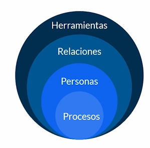

* ¿Qué hicimos bien?
* ¿Qué no hicimos tan bien?
* ¿Qué podemos mejorar?

En base a las respuestas se identifican elementos más importantes, se buscan soluciones y se crea un plan de acción para aplicar mejoras

# Crecer usando scrum

## Escalabilidad

Scrum es capaz de funcionar con proyectos de 10 personas como proyectos de 100 personas y más

La forma en como está diseñado scrum permite enfrentar proyectos de distintos niveles de complejidad

  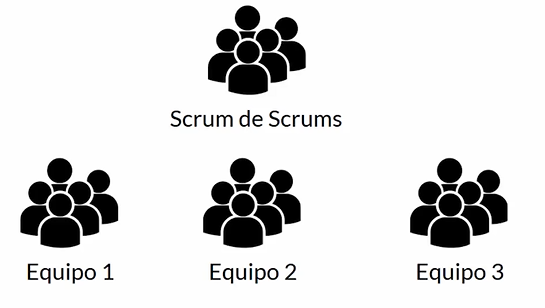

Es una reunión dónde frecuentemente se encuentran miembros de todos los equipos y que permite coordinar esfuerzos entre los distintos equipos de la organización

## Comunidades de práctica

  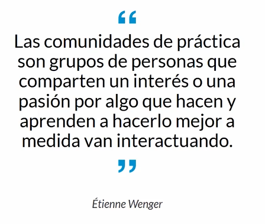

  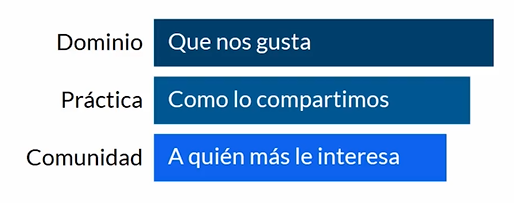

* Basada en roles
* Basada en tópicos

  

